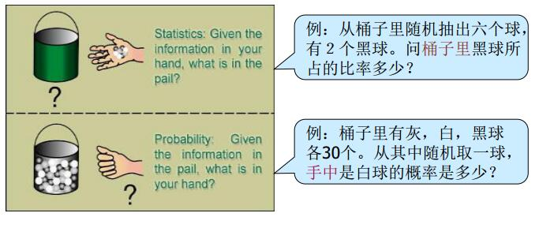
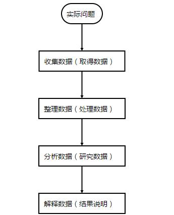
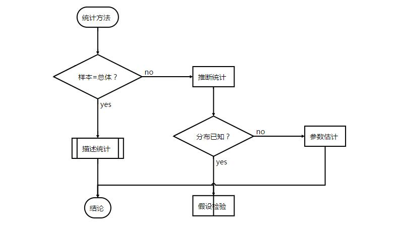

\mainmatter

# Introduction {#intro}

本部分内容是我这学期公选课《应用统计学》的学习笔记，主要参考书目为如下两本：


> * 贾俊平，《统计学》（第五版），中国人民大学出版社，2012.

> * 何晓群，《多元统计分析》（第三版），中国人民大学出版社，2012. 

本篇为第一章节，也就是Introduction（简介）部分。


## 从问题说起

常常听到的一句话，好的科学论文解决一个科学问题，科学的诞生本身就和问题离不开。老生常谈的就是像牛顿被苹果砸了之后，就想到一个问题，为啥苹果不飞上天和太阳肩并肩呢？我答：因为会被烤焦。。。。嗯，幽默一下。总结下来说，科研中有很多问题跟统计学相关（笔者是地学和生态学背景，就提点接地气的问题）。譬如：

（1)人口研究当中，我们希望了解65岁以上老年人所占的比例，以便于我们更好地研究老龄化的问题。

（2)从几个监测站点的汽车尾气监测推断今天北京市的汽车尾气排放是否达到大气污染物排放标准。

（3）影响植物光合作用的因素是什么，各个因素的影响有多大？

以及等等等。总结来说，可以分为以下的几类：（1）统计量问题；（2）参数（推断统计）问题；（3）归因问题；（4）预测问题。


## 统计学及其研究过程

那么统计学又是什么呢？

> * statistics: the science of collecting,analyzing, presenting, and interpreting data.
Copyright 1994-2000 Encyclopaedia Britannica, In

翻译过来就是

> * 统计学是收集、分析、表述和解释数据的科学（ 不列颠百科全书）

所以统计学包括了：

> * 数据收集：取得数据
> * 数据处理：整理与图表展示
> * 数据分析：利用统计分析方法分析数据
> * 数据解释：结果的说明
> * 得到结论：从数据分析中得出客观结论。

同时跟统计学密切相关的就是概率论。这二者都是研究随机现象数量规律的学科。而二者的区别可以用一张图来形象体现：

```{r echo=FALSE, out.width = '60%', out.height = '30%', message=FALSE, warning=FALSE}

```


也就是说，概率论是——我知道箱子里面是什么样的，我想知道我拿在手里的球是什么样的可能性分别有多大。统计学则是——我不知道箱子里面是什么样的，但是我已经知道我拿在手里的球是什么样的，我想靠我手里的球的样子去推断箱子是什么样的。有兴趣的也可以查看知乎上的回答。

> * https://www.zhihu.com/question/20269390

总结起来，统计学的研究过程就像下面的流程图。


```{r echo=FALSE, out.width = '80%', out.height = '60%', message=FALSE, warning=FALSE}

```


当然这里面很容易出问题的是解释数据——数学上有意义，并不代表现实中有意义，非常容易出现很多的悖论。比如太阳升起的时间与每个人起床时间相关性很高，但是我不能说因为每个人都起床了，所以太阳升起了。


## 统计方法及其应用领域
从前面提到的我们知道，统计方法是通过已知的观测数据去分析随机现象的数量规律。因此统计方法就包括了两大部分：描述统计与推断统计。其实核心就在于我们所观测的样本是否等于总体。样本=总体，那么使用描述统计就能够用来描述我们所研究的现象。样本≠总体，那么使用推断统计才能较为准确地描述我们所研究的现象。事实上，近年来火热的大数据就是因为技术（传感器等）发展，我们足够获取可以近似等于全样本甚至全样本的数据而不是以往的样本数据所引起的一场变革，也就是说是由数据驱动的变革。


```{r echo=FALSE, out.width = '100%', out.height = '45%', message=FALSE, warning=FALSE}

```

统计学应用领域十分广泛，这里就不细谈了。

## 统计数据类型

由于应用广泛，所以统计数据类型也是多样化的。不同的划分标准类型也不相同：

（1）按照计量层次划分

> * 分类数据
> * 顺序数据
> * 数值数据

（2）按收集方法划分

> * 调查观察数据
> * 试验数据

（3）按时间状况划分

> * 截面数据
> * 时序数据

## 统计学中的几个基本概念

统计学中的基本概念分别是：

> * 总体（population）——研究对象的全体
> * 样本（sample)——研究对象的部分个体，观测数据
> * 参数（parameter)——用来描述总体的数学度量
> * 统计量（statistic)——用来描述样本的数学度量
> * 变量（variable)——描述现象的某种特征

```{r echo=FALSE, out.width = '60%', out.height = '20%', message=FALSE, warning=FALSE}

```
