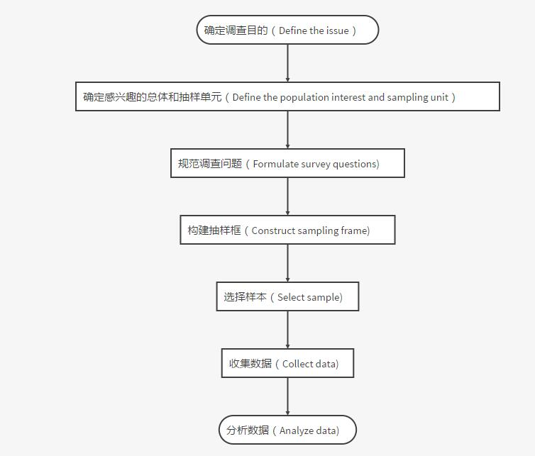
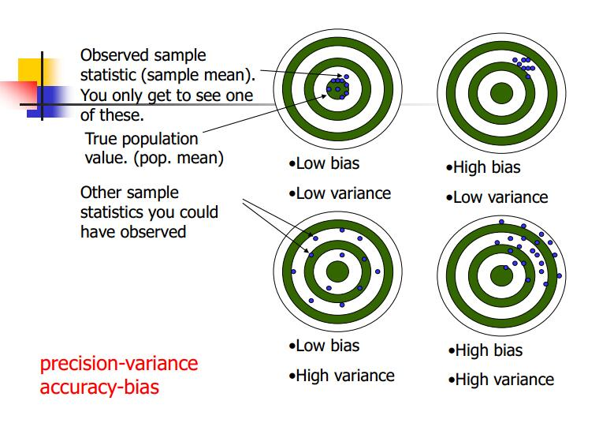

# Data Collection {#datacollec}

本篇是第二章，内容是数据收集。

## 数据来源
做科学研究离不开数据，而数据的来源有哪些呢？这里比较简单地将数据来源分为两类：直接（一手）数据和间接（二手）数据。直接数据的数据获取来源包括：观测、调查、实验。间接数据的数据获取来源包括：出版物、互联网等。


接下来分别谈谈这几个来源。观测——自然科学里有观测，如气象气候、植物生长期等，社会科学同样有观测，譬如像街区人的观测等。观测的数据可以说是纯粹第一手数据，在研究中是很宝贵的数据，但是很容易受到观测记录员主观因素的影响。调查——自然科学里的调查（室外样品采集，环境状况调查）一般是跟室内实验相结合，而社会科学的调查会更丰富，如典型的问卷调查、访谈、座谈会等。实验——实验是自然科学的核心，这里就不详述了（比如：土壤理化性质分析、植物生态生理特性分析）。不过近年来随着学科交叉增多，社会科学也开始更多地引入实验的方法（以笔者另一门公选课《初级社会网络》为例，耶鲁大学的社会心理学家米尔格兰姆(Stanley Milgram)就设计了一个连锁信件实验，这就是著名的六度分割理论的由来）。
当然除了以上三种，我认为在现在的大数据时代，还存在一些新的直接数据来源。

> * 物联网（Interest of Thing,IOT),以各类传感器（RFID、红外感应系统、GPS、通量塔等）为代表，代表数据就是如今火热的大数据——如RFID记录数据、浮动车与出租车GPS轨迹数据、通量塔测量的NEE等。
> * 遥感（Remote Sensing，RS），某种程度上，遥感也是靠传感器接收数据，但是它与物联网还是有所差别，故单列出来。作为地学和生态学背景（尤其是GIS和RS相关方向的）的学生，对遥感会非常熟悉。遥感的特征就是，可以大范围快速获取地表信息数据（譬如地形、地表温度、气溶胶、albedo等，当然这些都需要进行反演等）。

总的来说，观测在自然科学和社会科学中都有渗透较多，但是观测往往受到记录人员主观因素影响导致误差。而且观测的数据结构一般来说呈现非结构化的特征。调查在社会科学中有较多应用，自然科学中较少，而实验则是在自然科学中应用广泛，社会科学则应用较少。这两类的实质是类似的，需要提前设计好调查的大纲或者实验方案，然后按照设计好的大纲和方案进行调查和实验。也因此这两类数据结构化特征比较明显。


所谓的间接数据就是指已经经过他人整理的相关数据。这边列出来的主要包括：出版物：统计年鉴、书籍、论文等。统计年鉴是大部分社会科学相关研究的重要数据来源，这边就不详述了。书籍对于很多如社会研究的文本分析是重要的数据来源。论文作为数据，是近年来兴起的文献计量学的典型数据。此外对Meta分析，论文里的数据则是重要来源。互联网：百度指数、阿里指数、大众点评等数据。互联网数据可以利用网络爬虫获取。总的来说，间接数据易于获取，作用广泛，但使用的时候需要控制数据质量以及引用。


## 调查设计
这边主要介绍的是数据的调查方式、调查方案的结构和设计以及调查问卷设计。

（1）数据的调查方式

数据的调查方式一般而言是遵循统计学规律的（我们称之为统计调查方式），这里列举了我国统计调查的常用方式：普查（人口普查、农业普查、甚至到最近刚刚发布成果的全国第一次地理国情普查）、抽样调查（概率抽样、非概率抽样，具体后面第三章会详述）、统计报表（统计公报）。而除了以上之外，当我们需要自己收集直接数据的时候又可以分为以下几种：

询问调查类：

> * 访问调查
> * 邮寄调查
> * 电话调查
> * 电脑辅助
> * 座谈会
> * 个别深访

观察实验:

> * 观察
> * 实验

（2）调查方案的结构和设计

如何做调查？是很多人在科学研究中的第一道难关。这里给出一个关于做调查的普遍步骤流程图：

```{r echo=FALSE, out.width = '100%', out.height = '60%', message=FALSE, warning=FALSE}

```


那么调查方案又是什么呢？我认为调查方案就是调查的策划书。明确你调查的一些目的、对象、项目以及调查方法等。一般结构如下：

> * 调查目的
> * 调查对象调查单位
> * 调查项目
> * 其他

（3）调查问卷设计

最后这部分是谈谈调查问卷设计的一些内容（包括笔者自己的一些经验）。

问卷结构

> * 开头部分（问候语、填写说明、问卷编号 ） 
> * 甄别部分
> * 主体部分
> * 背景部分

其他部分就不详述了，甄别部分一般是针对过滤的问题，就是不符合条件的即可跳过部分调查题目。接下来主要针对主体部分简单介绍。主体部分其实就是问卷主要调查的部分。一般来说要注意一下几点。

> * 提问内容尽可能简短
> * 用词准确通俗（可按6W原则推敲：Who,Where,When,Why,What,How）
> * 一项提问只包括一项内容
> * 避免诱导性提问、否定形式提问、敏感性问题

而问题则又可以分为两大类：开放性问题（自由回答型）和封闭性问题（选择回答型）。封闭性问题包括了二项选择、多项选择（单项、多项、限制选择）、顺序选择法、评定尺度法、双向列联表法。

> * 开放性问题——一般就是可以随便答，这类数据一般是问卷者的主观感受，不会受客观影响。但是最大的问题在于数据收集呈现非结构化特征，多以文本形式存在。研究时必须通过重编码、文本分析等方法。
> * 封闭性问题——相当于是选择题或者填空题。二项选择就是，只有两个选项（A或B）；多项选择则是有多个选项，可以选至少一个（一个为单项、一个以上且不限制选择的数量为多项、一个以上且限制选择的数量为限制）；顺序选择法，就是给出多个选项，让你按照自己的认识对选项进行排序；评定尺度法，给出多个选项且是有等级划分的（如很差，差，一般，好，很好）进行选择；双向列联表法，将两类不同问题综合到一起，用表格形式，横向为一类问题，纵向为一类问题。

从笔者的经验来说，在设置问卷的时候，必须要先从自己想研究的问题出发，思索如何用数据分析证明自己的结论，然后大致思索需要用来分析的统计方法与统计指标，然后对应选择问题的形式，因为不同的问题形式对应的数据结构大不相同，而且统计方法也不尽相同。最后的最后安利大家一个软件：Survey123 for ArcGIS。这是由esri北京研发中心开发的一款外业数据收集软件——获得“问卷好帮手”称号的application。

> * http://www.esri.com/products/survey123

主要包括了桌面端Survey123 connect和移动端Survey123 app两大软件。可以简便地建立问卷、分享问卷、搜集数据、分析数据，同时采集时受访者的GPS位置也将被记录。具体教程参照如下网址。

> * http://doc.arcgis.com/zh-cn/survey123/

## 数据质量
采集数据的时候必须考虑的就是数据的质量，即降低采集数据时产生误差。科学研究中的数据误差无可避免，而误差的来源主要包括：抽样误差、非抽样误差。抽样误差，在抽样方式确定时就无法避免，具体的方法可能还是统计学万能解药———增加样本量。非抽样误差则包括了如下的内容：

> * 抽样框误差
> * 回答误差
> * 无回答误差
> * 调查员误差

抽样框误差——其实就是抽取的样本无法代表总体；回答误差和无回答误差都是由于受访者导致的错误，而调查员误差则无须再介绍，即采集者自身的误差。那么控制误差的方法无非就在于样本大小以及合适的数据框（针对非抽样误差和抽样框误差），靠重访来进行修正（回答误差和无回答误差），调查员误差则需要对调查员进行培训。当然这里还得普及一个概念，在统计学里面，precision（精度）和accuracy（准确性）是不相同的。中文里面往往因为两个单词都翻译成精度，事实上这两个词指的是不一样的内容。二者的区别可以看下面的图。


```{r echo=FALSE, out.width = '100%', out.height = '50%', message=FALSE, warning=FALSE}

```

