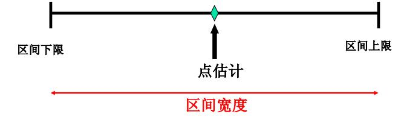

# Estimation {#estimation}

本篇是第五章，内容是参数估计。

## 参数估计的一般问题

正如前面介绍的，统计学的两大分支，分别是描述统计和推断统计。所以今天来谈谈推断统计的第一大问题——参数估计。当然一般叫统计推断的会更多些，二者是一样的。统计推断(Statistical Inference)——主要包括参数估计和假设检验，实质就是通过样本的均值、标准差、方差等去估计总体的均值、标准差、方差或者判断总体的分布形式和分布参数。

> * 参数估计：根据从总体中抽得的样本所提供的信息，对总体分布中包含的未知参数作出数值上的估计。
点估计：用样本的某一函数值来估计总体分布中的未知参数;
区间估计：按照一定的可靠度估计出参数的一个范围，即确定一个区间，使这一个区间内包含参数真值的概率达到预先所要求的程度。
> * 假设检验：需要对总体的分布形式或分布参数事先作出某种假设，然后根据样本观测值，运用统计分析的方法来检验这一假设是否正确。

上一篇提到的，获取样本之后，我们需要去猜总体，参数估计就是猜总体的参数（分布中所含的未知参数；分布特征：均值、方差等；事件的概率等）或者参数空间(参数的可能取值范围)。假设检验是下一章内容，这里就不细述了。首先明确两个概念：估计量（estimator）与估计值(estimated value)。

> * 估计量： 用于估计总体参数的随机变量，一般为样本统计量（如样本均值、 样本比例、 样本方差等； 例如：样本均值就是总体均值$\mu$的一个估计量）。
> * 估计值： 估计参数时计算出来的统计量的具体值,如果样本均值=80， 则80就是总体均值的估计值。

既然是估计量，就必须有评价估计量的标准。一般包括以下几点：

> * 无偏性：估计量的数学期望等于被估计的总体参数，样本的随机性导致估计偏差， 偏差平均值为0， 无系统误差（所以在这里又提出了渐进无偏估计：估计随着样本量的增加而逐渐趋近于真值。渐进无偏估计指系统偏差会随着样本量的增加而逐渐减小，趋于0，在大样本时可近似当无偏估计使用）。
> * 有效性： 对同一总体参数的两个无偏点估计量， 有更小标准差的估计量更有效。
> * 一致性： 随着样本容量的增大， 估计量的值越来越接近被估计的总体参数。

由于无偏性是最普遍的标准。这里再介绍部分无偏性的几个要点：

> * 样本均值是总体期望的无偏估计。
> * 诸观测值对样本均值的偏差可正可负，其和恒为0（n个偏差中只有n-1个是独立的）。
> * 自由度：独立偏差个数。
> * 偏差平方和（样本量相等情况下，偏差平方和的大小反映样本散布的大小， 样本量大，偏差平方和大趋近于平均偏差平方和，偏差平方和的期望小于方差，有偏估计，渐进无偏估计。

点估计（point estimate）

> * 用样本估计量的某个取值直接作为总体参数的估计值（例如：用样本均值直接作为总体均值的估计；用两个样本均值之差直接作为总体均值之差的估计）。
> * 无法给出估计值接近总体参数程度的信息（虽然在重复抽样条件下，点估计的均值可望接近总体真值，但由于样本是随机的，抽出一个具体的样本得到的估计值等同于总体真值的可能性很小，特别是在连续分布时，该概率几乎为0，一个点估计量的可靠性是由它的抽样标准误差来衡量的，这表明一个具体的点估计值无法给出估计的可靠性的度量）。

## 区间估计 Confidence Intervals

正如前面提到的点估计可靠性较低，因此在点估计的基础上又提出了区间估计(interval estimate)，它能解决的问题包括：

> * 为解决参数估计的精确度和可靠性问题， 在点估计的基础上给出总体参数估计的一个区间范围（该区间一般由样本统计量加减抽样误差而得到），使这一个区间内包含参数真值的概率大到预先所要求的程度。
> * 它不具体指出总体参数等于什么，但能指出总体的未知参数落入某一区间的概率有多大。

二者的区别在于：点估计是一个数，区间估计给出一个区间，提供更多关于变异性的信息。通俗的解释，你女朋友买了件衣服，让你猜价格，你猜中准确价格很难，但是你猜一个范围还是准确度比较高的。

```{r echo=FALSE, out.width = '100%', out.height = '30%', message=FALSE, warning=FALSE}

```

所以区间估计(interval estimate)的概念是——根据样本统计量的抽样分布能够对样本统计量与总体参数的接近程度给出一个概率度量。由概率度量则引出了置信区间（Confidence Intervals）的概念。设$x_1,x_2,\cdots,x_n$是来自$f(x,\theta)$的样本，对于给定的$\alpha,0<\alpha<1$,如能找到两个统计量$\theta_1(x_1,x_2,\cdots,x_n)$和$\theta_2(x_1,x_2,\cdots,x_n)$使得$P\left\{(\theta_1(x_1,x_2,\cdots,x_n)<\theta<\theta_2(x_1,x_2,\cdots,x_n)\right\}\ge1-\alpha$, 称$(\theta_1(x_1,x_2,\cdots,x_n),\theta_2(x_1,x_2,\cdots,x_n))$是$\theta$的置信度为$1-\alpha$的置信区间(Confidence interval);$\theta_1,\theta_2$为置信上限与置信下限,$1-\alpha$为置信度,$\alpha$为显著性水平(Significance level)。

置信区间实质上是由样本统计量所构造的总体参数的估计区间。在某种程度上确信这个区间包含真正的总体参数（用一个具体的样本所构造的区间是一个特定的区间，我们无法知道这个样本所产生的区间是否包含总体参数的真值，我们只能是希望这个区间是大量包含总体参数真值的区间中的一个，但它也可能是少数几个不包含参数真值的区间中的一个）。置信区间表明了区间估计的精确性， 区间越小越精确，区间越大越不精确。置信水平——将构造置信区间的步骤重复很多次，置信区间包含总体参数真值的次数所占的比例称为置信水平（置信度）。置信水平表明了区间估计的可靠性，表示为$(1-\alpha)$，$\alpha$是总体参数未在区间内的比例， 区间估计不可靠的概率为$\alpha$， 如$\alpha$=0.05， 表明结论犯错误的概率为0.05),常用的置信水平值有99%, 95%, 90%。那么什么样的置信区间是好的置信区间呢？也就是区间估计的评价标准是什么呢？一般包括如下两点：

> * 置信度（置信系数）越大越好——概率越大越放心，但不能一味求大。
> * 随机区间平均长度越短越好——估计精度越高。

但是在某些实际问题中，我们可能更关心置信上限或置信下限(合金钢强度，越大越好（望大特性），平均强度下限是个重要指标,药物毒性，越小越好（望小特性），平均毒性上限是个重要指标)。这就是单侧置信限问题。谈完了这么多理论，接下来进入实践，如何做一个总体参数的区间估计？
按照前一章，我们还是讨论三个重要的总体参数：均值、比例、方差。也是先谈一个总体参数的区间估计。首先规定好符号对应统计量和参数。


总体均值——$\mu$，总体比例——p，总体方差——$\sigma^2$;样本均值——$\bar x$，样本比例——$\bar p$，样本方差——$s^2$。


- 一个总体均值的置信区间估计方法总结起来就是：

> * 正态分布，且总体方差$\sigma$已知，用Z值；
> * 正态分布，且总体方差$\sigma$未知，用t值；
> * 非正态分布但是大样本，无论总体方差$\sigma$是否已知，用Z值。

第一种情况：正态分布统计量z——$z=\frac{\bar x-\mu}{\sigma/\sqrt{n}}\sim N(0,1)$，总体均值$\mu$在$1-\alpha$置信水平下的置信区间为$\bar x\pm z_{\alpha/2}\frac{\sigma}{\sqrt{n}}$，置信下限为$\bar x- z_{\alpha/2}\frac{\sigma}{\sqrt{n}}$，置信上限为$\bar x+ z_{\alpha/2}\frac{\sigma}{\sqrt{n}}$。

第二种情况：t分布统计量——$t=\frac{\bar x-\mu}{s/\sqrt{n}}\sim t(n-1)$，总体均值$\mu$在$1-\alpha$置信水平下的置信区间为$\bar x\pm t_{\alpha/2}\frac{s}{\sqrt{n}}$，置信下限为$\bar x- t_{\alpha/2}\frac{s}{\sqrt{n}}$，置信上限为$\bar x+ t_{\alpha/2}\frac{s}{\sqrt{n}}$。

第三种情况：正态分布统计量z——$z=\frac{\bar x-\mu}{\sigma/\sqrt{n}}\sim N(0,1)$，总体均值$\mu$在$1-\alpha$置信水平下的置信区间为$\bar x\pm z_{\alpha/2}\frac{\sigma}{\sqrt{n}}$（$\sigma$未知的话，把$\sigma$换成s即可）。


- 一个总体比例的置信区间估计方法

假定条件$np\geq5$, $n(1-p)\geq5$, $n\geq30$。正态分布统计量z——$z=\frac{\bar p-p}{\sqrt{\frac{p(1-p)}{n}}}\sim N(0,1)$，总体比例的置信区间为

$$\bar p\pm z_{\alpha/2}\sqrt{\frac{p(1-p)}{n}}$$

或

$$\bar p\pm z_{\alpha/2}\sqrt{\frac{\bar p(1-\bar p)}{n}}$$。


- 一个正态总体方差的置信区间估计方法

总体方差$\sigma^2$的点估计量为$s^2$，则$\frac{(n-1)s^2}{\sigma^2}\sim \chi^2(n-1)$，总体方差在$1-\alpha$置信水平下的置信区间为：

$$\frac{(n-1)s^2}{\chi^2_{\alpha/2}(n-1)}\le \sigma^2 \le \frac{(n-1)s^2}{\chi^2_{1-\alpha/2}(n-1)}$$


接下来谈谈两个总体参数的置信区间的估计方法。估计的一般包括均值差、比例差、方差比，主要包括两种抽样方法——独立样本和配对样本。

- 两个正态总体均值之差的置信区间（独立样本）：

$\sigma_1^2$，$\sigma_2^2$已知，使用正态分布统计量z：$z=\frac{(\bar x_1-\bar x_2)-(\mu_1-\mu_2)}{\sqrt{\frac{\sigma_1^2}{n_1}+\frac{\sigma_2^2}{n_2}}}\sim N(0,1)$，两个总体均值之差$\mu_1-\mu_2$在$1-\alpha$置信水平下的置信区间为：

$$(\bar x_1-\bar x_2)\pm z_{\alpha/2}\sqrt{\frac{\sigma_1^2}{n_1}+\frac{\sigma_2^2}{n_2}}$$。

$\sigma_1^2=\sigma_2^2$未知，总体方差的合并估计量：$s_p^2=\frac{(n_1-1)s_1^2+(n_2-1)s_2^2}{n_1+n_2-2}$，估计量$\bar x_1-\bar x_2$的抽样标准差：$\sqrt{\frac{sp_1^2}{n_1}+\frac{sp_2^2}{n_2}}$，两个样本均值之差的标准化：$t=\frac{(\bar x_1-\bar x_2)-(\mu_1-\mu_2)}{s_p\sqrt{\frac{1}{n_1}+\frac{1}{n_2}}}\sim t(n_1+n_2-2)$，两个总体均值之差$\mu_1-\mu_2$在$1-\alpha$置信水平下的置信区间为：

$$(\bar x_1-\bar x_2)\pm t_{\alpha/2}(n_1+n_2-2)\sqrt{s_p^2(\frac{1}{n_1}+\frac{1}{n_2})}$$。

$\sigma_1^2\neq\sigma_2^2$未知，$n_1=n_2: (\bar x_1-\bar x_2)\pm t_{\alpha/2}(n_1+n_2-2)\sqrt{(\frac{s_1^2}{n_1}+\frac{s_2^2}{n_2})}$。

$\sigma_1^2\neq\sigma_2^2$未知，$n_1\neq n_2$：$(\bar x_1-\bar x_2)\pm t_{\alpha/2}(v)\sqrt{(\frac{s_1^2}{n_1}+\frac{s_2^2}{n_2})}$， v为自由度，$v=\frac{(\frac{s_1^2}{n_1}+\frac{s_2^2}{n_2})^2}{\frac{(s_1^2/n_1)^2}{n_1-1}+\frac{(s_2^2/n_2)^2}{n_2-1}}$。

- 两个总体均值之差的区间估计(独立大样本)两个总体均值之差的估计

$\sigma_1^2$，$\sigma_2^2$已知时，两个总体均值之差$\mu_1-\mu_2$在$1-\alpha$置信水平下的置信区间为：

$$(\bar x_1-\bar x_2)\pm z_{\alpha/2}\sqrt{(\frac{\sigma_1^2}{n_1}+\frac{\sigma_2^2}{n_2})}$$。

$\sigma_1^2$，$\sigma_2^2$未知时，两个总体均值之差$\mu_1-\mu_2$在$1-\alpha$置信水平下的置信区间为：

$$(\bar x_1-\bar x_2)\pm z_{\alpha/2}\sqrt{(\frac{s_1^2}{n_1}+\frac{s_2^2}{n_2})}$$。

两个总体均值之差的区间估计(匹配样本)，匹配大样本的假定条件——两个匹配的大样本($n_1\ge30$和$n_2\ge30$)；

两个总体均值之差$\mu_d=\mu_1-\mu_2$在$1-\alpha$置信水平下的置信区间为：

$$\bar d\pm z_{\alpha/2}\frac{\sigma_d}{\sqrt{n}}$$

或

$$\bar d\pm z_{\alpha/2}\frac{s_d}{\sqrt{n}}$$。

$\bar d$为对应差值的均值，$\sigma_d$为对应差值的标准差。

匹配小样本的假定条件——两个匹配的小样本($n_1<30$和$n_2<30$)，两个总体各观察值的配对差服从正态分布。两个总体均值之差$\mu_d=\mu_1-\mu_2$在$1-\alpha$置信水平下的置信区间为：

$$\bar d\pm t_{\alpha/2}(n-1)\frac{s_d}{n}$$


两个总体比例之差区间的估计，假定条件——两个总体服从二项分布，可以用正态分布来近似，两个样本是独立的。

两个总体比例之差$p_1-p_2$在$1-\alpha$置信水平下的置信区间为：

$$\bar p_1-\bar p_2\pm z_{\alpha/2}\sqrt{\frac{\bar q_1(1-\bar q_1)}{n_1}+\frac{\bar q_2(1-\bar q_2)}{n_2}}$$。

两个正态总体方差比的置信区间，实际应用如两种不同方法生产的产品性能的稳定性或两种不同测量工具的精度，需要我们去比较两个总体方差。

两个正态总体方差比的估计，比较两个总体的方差比，用两个样本的方差比来判断（如果$s_1^2/s_2^2$接近于1，说明两个总体方差很接近；如果$s_1^2/s_2^2$远离1，说明两个总体方差存在差异）。

总体方差比在$1-\alpha$置信水平下的置信区间为：

$$\frac{s_1^2/s_2^2}{F_{\alpha/2}}<\frac{\sigma_1^2}{\sigma_2^2}<\frac{s_1^2/s_2^2}{F_{1-\alpha/2}},F\sim F(n_1-1,n_2-1)$$

(F分布性质：$F_{1-\alpha/2}(n_1,n_2)=\frac{1}{F_{\alpha/2}(n_2,n_1)}$)。

总的来说，参数估计的东西很多，根据具体研究情况，我们可以根据自己需求选择不同的参数估计。当然据笔者所知，R语言在参数估计上，现成函数（指默认的基础包）比较少，一般需要自编函数或者有额外的包。这里先给出一个样例函数（14章中会涉及到一部分，这里不详述）。

```{r eval=FALSE, echo = T}
conf.int <- function(x,sigma,alpha) {
  mean = mean(x)
  n = length(x)
  z = qnorm(1-alpha/2, mean = 0, sd = 1, lower.tail = T)
  c(mean-sigma*z/sqrt(n), mean+sigma*z/sqrt(n))
  }
```

## 样本容量的确定
前一章我们提到统计学闻名于世的规定，样本容量一般必须＞30。但是这种规定，并不是万能的。所以样本容量的确定就成了一个问题。n过大费用高、时间长、人力多；n过小误差增大。事实上n的确定依赖于多大置信度（可靠性），什么样的精度（多宽的区间）。所以样本容量的确定需要根据置信区间的性质来决定。置信区间的性质——以正态总体小样本容量为例。首先置信区间的宽度:$w=2z\frac{\sigma}{\sqrt{n}}$，因此很容易发现影响区间宽度的因素包括了：

> * 样本容量：大样本容量——小区间。
> * 总体数据的离散程度：小方差——小区间。
> * 置信水平：高置信度——大t值——大区间。

边际误差（margin error)——置信区间上下限与点估计之间的距离。

$$ E=z\frac{\sigma}{\sqrt{n}} $$

给定边际误差E和置信水平$1-\alpha$，可以找到所需要的样本容量。

估计总体均值时样本容量的确定($\sigma^2$已知)：$n=\frac{(z_{\alpha/2})^2\sigma^2}{E^2}$，其中$E=z_{\alpha/2}\frac{\sigma}{\sqrt{n}}$。

样本容量n与总体方差$\sigma^2$、边际误差E、置信水平$1-\alpha$之间的关系为：

> * 随总体方差增大而增大。
> * 随边际误差减小而增大。
> * 随$1-\alpha$增大而增大，随$\alpha$减小而增大。

$\sigma$未知，如有近期样本可用，用其样本标准差代替$\sigma$，用t分布分位数代替标准正态分布分位数，自由度为近期样本容量-1。否则，可以用一个至少比$\sigma$大的数来替代$\sigma$，抽一个样本，用s代替$\sigma$——Stein 两步法。

估计总体比例时样本容量的确定：根据比例区间估计公式可得样本容量n为$n=\frac{(z_{\alpha/2})^2\cdot p(1-p)}{E^2}$，其中：$E=z_{\alpha/2}\sqrt{\frac{p(1-p)}{n}}$，E的取值一般小于0.1，p 未知时， 可用之前样本比率估计，或保守的取最大值0.5。

估计两个总体均值之差时样本容量的确定：设$n_1$和$n_2$为来自两个总体的样本，并假定$n_1=n_2$。根据均值之差的区间估计公式可得两个样本的容量n为：

$$n_1=n_2=n=\frac{(z_{\alpha/2})^2\cdot (\sigma_1^2+\sigma_2^2)}{E^2}$$

其中$E=z_{\alpha/2}\sqrt{\frac{(\sigma_1^2+\sigma_2^2)}{n}}$。

估计两个总体比例之差时样本容量的确定：设$n_1$和$n_2$为来自两个总体的样本，并假定$n_1=n_2$。根据比例之差的区间估计公式可得两个样本的容量n为：

$$n_1=n_2=n=\frac{(z_{\alpha/2})^2\cdot [p_1(1-p_1)+p_2(1-p_2)]}{E^2}$$

其中$E=z_{\alpha/2}\sqrt{\frac{(p_1(1-p_1)+p_2(1-p_2))}{n}}$。

总的来说，样本容量的确定也是根据具体需要以及显著性水平计算得到的。
