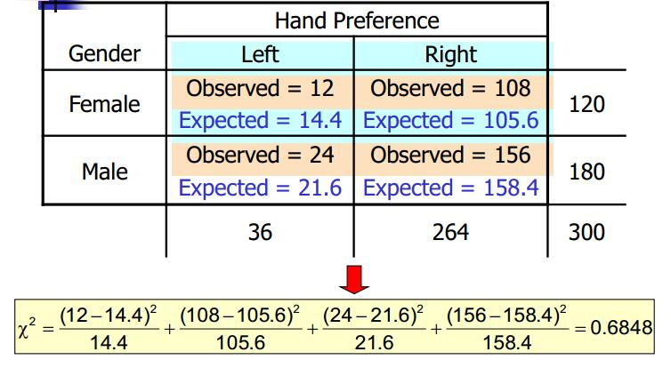

# Goodness of Fit {#goodness}
本篇是第七章，内容是拟合优度检验。

## 多项分布

拟合优度检验的第一个应用是关于多项总体。那么多项总体（或者多项分布）是什么呢？

> * 多项分布是二项分布的推广。
> * 总体被分为几个互不相交的类别。
> * 多项分布假设：每次试验有且仅有一个结果发生；每次试验独立；每次试验概率不变。

拟合优度检验-多项总体步骤，将所观测到的数据与理论上的期望值进行比较。步骤：

> * 1.计算每一类实际观测到的频次$f_i$；
> * 2.计算每一类理论上的期望频次$e_i$；
> * 3.计算 Chi-square 统计量——$\chi^2=\sum(f_i-e_i)^2/e_i$。其中自由度 (df) = k-1， k 是多项总体的类别数。

拟合优度检验用于多项总体检验没有直接的函数，这里用R语言的自编函数实现，体会下具体的算法（当然感觉自己写的略复杂）。代码依旧是后面放出，函数具体使用说明也会附上。

## 独立性

依旧是从问题出发——性别与购物频率是否有关系。独立性检验——该统计方法常用于检验两个分类变量是否有关系。那么首先要提到两个概念——独立事件和非独立事件（independent and dependent events)。

> * 独立事件——一个事物发生不会对其他事物发生概率造成影响。
> * 非独立事件——一个事物发生会影响其他事物发生概率。

接着统计学构建出了一个表来进行独立性检验。这就是联立表（Contingency Tables)。

> * 解决多总体比例问题。
> * 之前通常用两个或两个以上特征来对样本观测值分类。
> * 也被称为交叉表。

```{r echo=FALSE, out.width = '100%', out.height = '35%', message=FALSE, warning=FALSE}

```

一般在R中，使用Table函数即可生成两个特征（分类变量）的联立表，xtabs则是根据公式创立联立表，prop.table则可以直接计算出比例。联立表如何做独立性检验呢？首先提出假设（这里不详述，相信大家应该懂怎么建立了），接着计算期望的联立表每个单元格的期望频次。

$$e_{ij}=\frac{(i^{th} Rowtotal)(j^{th} Columtotal)}{Total SampleSize}$$。

接着就可以对比实际频次和期望频次，然后我们用卡方（chi-square)统计量进行检验。

$$\chi^2=\sum_{i=1}^n\sum_{j=1}^m\frac{(f_{ij}-e_{ij})^2}{e_{ij}} with, df=(n-1)(m-1)$$。

n为行数，m为列数，$f_{ij},e_{ij}$分别为第i行和第j列的$cell_{ij}$实际频次和期望频次。当然这个方法也可以用来检验顺序变量和分类变量。方法类似，这里不赘述。

## 概率分布
拟合优度检验的最重要的应用其实是探测一个数据具体的概率分布。当然探测数据分布的第一方式——是可见即可得的可视化。主要包括前面提到过的直方图和QQ图。QQ图——Quantile-Quantile Plots（分位数图）：

> * 适用于小数据集。
> * 猜测分布的基础方法。
> * 用来绘制QQ图的数据必须落在该分布内。
> * 如果散点图接近直线，说明数据分布接近正态分布。

这里给出绘制QQ图的原理：

> * 对样本容量为N的样本数据按照升序排序。
> * 计算从1到N排序的百分比。
> * 从百分位数得分的关系找到中心分数。
> * 找到对应于中心分数的z值（标准正态分布）。
> * 绘制对应z值的观测点数据。

接着用R语言实现。

```{r eval=FALSE, echo = T}
#QQ plot
#generation of random number that fall in normal distribution
a<-rnorm(200,0,1)

#plot
qqnorm(a)
qqline(a,col="red")
```


```{r echo=FALSE, out.width = '100%', out.height = '40%', message=FALSE, warning=FALSE}
a<-rnorm(200,0,1)
qqnorm(a)
qqline(a,col="red")
```


除了QQ图之外，另外一类方法就是通过统计方法——拟合优度检验来探测数据是否正态分布。以正态分布为例。过程：

> * 获取样本数据。
> * 将样本结果分组（单元格）。
> * 比较实际与预期值。

统计量如下：
$$\chi^2=\sum_{i=1}^k\frac{(f_i-ei-)^2}{e_i}$$。

R语言中可以用chisp.test函数进行正态分布测验。

此外对于有某种特定分布的非正态数据可以通过数学变换转变为正态分布数据。常用的一般包括：

> * 对数变换。
> * 开方变换。
> * 指数或平方变换。

这里的数学变换需要根据大家实际研究需求决定。
