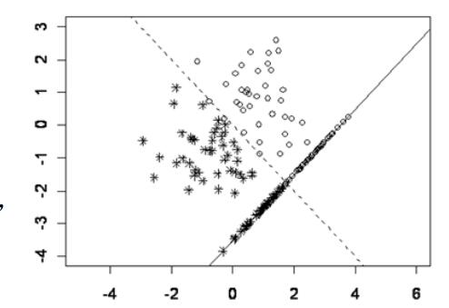
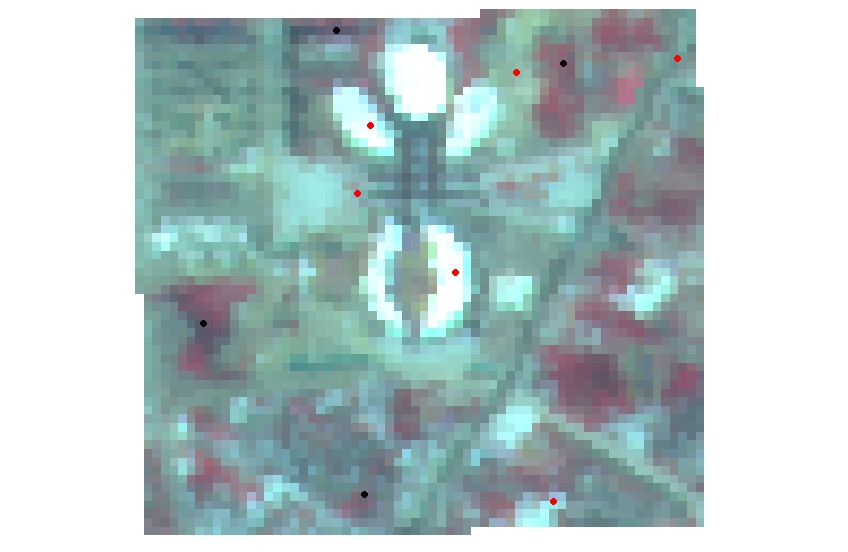
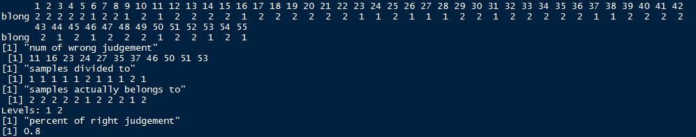
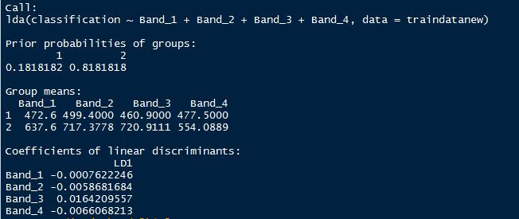
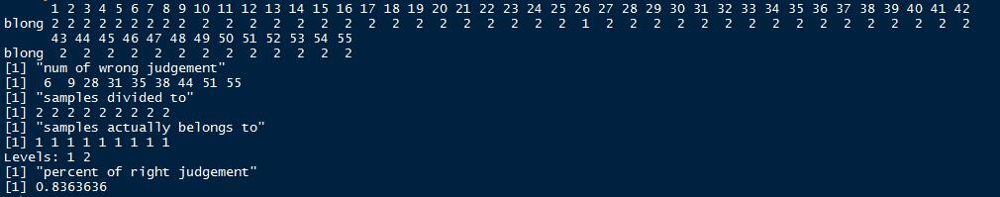
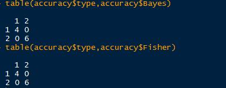

# Discriminant Analysis  {#discriminant}

本篇是第十一章，内容是判别分析。

## 判别分析应用
判别分析（Discriminant Analysis）——判别分析的目的是对已知分类的数据建立由数值指标构成的分类规则，然后把这样的规则应用到未知分类的样本中去分类，以识别未知样本所属的类别。判别分析是多元数据分析的重要方法之一。通常解决被解释变量是非数值变量，解释变量是数值变量的情形。

事实上地学领域应用判别分析最多的是在哪里呢？其实是遥感影像的地物分类，通常遥感导论中无论Erdas或者ENVI在做完监督分类之后，其实就是用标注的样本去训练判别函数，然后用判别函数完成整幅影像的判别分析，就可以分出不同的地物类型，这种方法就是我们最普遍使用的极大似然法。而这里的被解释变量就是地物类型，解释变量（多元）就是遥感影像不同波段的DN值，或者是辐射率。

> * 聚类分析和判别分析差异：在聚类分析中，人们一般事先并不知道应该分成几类及哪几类，全根据数据确定。在判别分析中，至少有一个已经明确知道类别的“训练样本”，并利用该样本来建立判别准则，并通过预测变量来为未知类别的观测值进行判别。通常实际问题中，可以先聚类以得知类型,再进行判别。

**用机器学习的话来说，聚类分析是非监督学习，判别分析属于监督学习。**

判别分析的数据结构

|individuals|$$X_1$$|$$X_2$$|$$\cdots$$|$$X_l$$|$$\cdots$$|$$X_p$$|**Y**|
|--|:--:|:--:|:--:|--:|--:|
|1|28|1.0|$$\cdots$$|114|$$\cdots$$|0.15|**1**|
|2|29|2.0|$$\cdots$$|117|$$\cdots$$|0.20|**1**|
|$$\cdots$$|$$\cdots$$|$$\cdots$$|$$\cdots$$|$$\cdots$$|$$\cdots$$|$$\cdots$$|$$\cdots$$|
|i|$$x_{i1}$$|$$x_{i2}$$|$$\cdots$$|$$x_{il}$$|$$\cdots$$|$$x_{ip}$$|**2**|
|$$\cdots$$|$$\cdots$$|$$\cdots$$|$$\cdots$$|$$\cdots$$|$$\cdots$$|$$\cdots$$|$$\cdots$$|
|47|15|8|$$\cdots$$|64|$$\cdots$$|0.51|**2**|
|48|16|7.5|$$\cdots$$|65|$$\cdots$$|0.50|**3**|
|$$\cdots$$|$$\cdots$$|$$\cdots$$|$$\cdots$$|$$\cdots$$|$$\cdots$$|$$\cdots$$|$$\cdots$$|
|n|$$x_{n1}$$|$$x_{n2}$$|$$\cdots$$|$$x_{nl}$$|$$\cdots$$|$$x_{np}$$|**3**|

对比聚类分析的数据结构，事实上就是多了最后一列的Y。

> * 个体由$X_1,X_2,\cdots,X_p$变量描述。
> * 有分类变量$Y$明确对个体分类。
> * 问题：建立$Y$与$X_1,X_2,\cdots,X_p$变量间关系的函数。根据函数将新个体进行分类。

**误判率**

误判率的高低有下面两个因素决定：

> * 主观因素：分界线的位置要正确。
> * 客观因素：均值，方差——通过选择指标来控制：一般来说，维度高一点，可以使分辨率高一些，但在许多情况下，指标太多，不仅不能提高分辨率，还增加计算量（需要丰富的实际经验和试算）；在做判别分析前，要做假设检验。在两个总体的均值有显著差异的情况下，再做判别分析。

**判别分析的假设**

> * 每一个判别变量（解释变量）不能是其他判别变量的线性组合——不符合该假设的话，无法估计判别函数，变量间高度相关或一变量与其他变量的线性组合高度相关时，参数估计的标准误差将很大。
> * 判别变量之间具有多元正态分布——可精确的计算显著性检验值和归属概率。
> * 如要采用线性判别函数，还要求各组协方差距阵相等——线性判别函数使用起来最方便、在实际中使用最广。

## 判别分析方法
### 距离判别法

**两总体情况**

假设有两个总体$G_1$和$G_2$，如果能够定义点x到它们的距离d(x,$G_1$)和d(x,$G_2$)，则可用如下规则进行判别：

> * 如果d(x,$G_1$) < d(x,$G_2$)则$x\in G_1$
> * 如果d(x,$G_2$) < d(x,$G_1$)则$x\in G_2$
> * 如果d(x,$G_1$) = d(x,$G_2$)则待判。

距离常选用马氏距离——假设$\mu_1,\mu_2,\Sigma_1,\Sigma_2$分别为$G_1$和$G_2$的均值向量和协方差阵，则点$x$到$G_i$的马氏距离为

$$d^2(x,G_i)=(x-\mu_i)'(\Sigma_i)^{-1}(x-\mu_i)$$ 

马氏距离的好处是可以克服变量之间的相关性干扰，并且消除各变量量纲的影响。

> * $$\Sigma_1=\Sigma_2=\Sigma$$

- 定义：

$$\begin{aligned}
d^2(x,G_1)-d^2(x,G_2) & =(x-\mu_1)'\Sigma^{-1}(x-\mu_1)-(x-\mu_2)'\Sigma^{-1}(x-\mu_2) \\ &=-2[x-(\mu_1+\mu_2)/2]'\Sigma^{-1}(\mu_1-\mu_2) \end{aligned}$$

令：$$\bar\mu=(\mu_1+\mu_2)/2, \alpha=\Sigma^{-1}(\mu_1-\mu_2),W(x)=(x-\bar\mu)'\alpha=\alpha'(x-\bar\mu)$$

判别规则：

> * 如果$W(x)>0\cdot d(x\cdot G_1) < d(x\cdot G_2)$则$x\in G_1$
> * 如果$W(x)<0\cdot d(x,G_,1) > d(x\cdot G_2)$则$x\in G_2$
> * 如果$W(x)=0，d(x\cdot G_1) = d(x\cdot G_2)$则待判。

称W(x)为判别函数(discriminant function)，α为判别系数。当$\mu_1,\mu_2,\Sigma$未知时，可通过样本来估计。$x_1^{(i)},\cdots,x_{n_i}^{(i)}$为来自$G_i$的样本(i=1,2)。

$$\hat\mu^{(i)}=\frac{1}{n_i}\sum_{k=1}^{n_2}x_k^{(i)}=\bar x^{(i)},\hat \Sigma=\frac{1}{n_1+n_2-2}(S_1+S_2)$$

$$S_i=\sum_{t=1}^{n_i}(x_t^{(i)}-\bar x^{(i)})(x_t^{(i)}-\bar x^{(i)})',\bar x=\frac{1}{2}(\bar x^{(1)}+\bar x^{(2)})$$

判别函数为$W(x)=(x-\bar x)'\hat \Sigma^{-1}(\bar x^{(1)}-\bar x^{(2)})$

> * $$\Sigma_1 \neq \Sigma_2$$

判别函数为二次函数

$$W(x)=d^2(x,G_2)-d^2(x,G_1)=(x-\mu_2)'\Sigma_2^{-1}(x-\mu_2)-(x-\mu_1)'\Sigma_2^{-1}(x-\mu_1)$$

按照距离最近原则，判别准则为：

> * 如果$W(x)>0\cdot d(x\cdot G_1) < d(x\cdot G_2)$则$x\in G_1$
> * 如果$W(x)<0\cdot d(x,G_,1) > d(x\cdot G_2)$则$x\in G_2$
> * 如果$W(x)=0，d(x\cdot G_1) = d(x\cdot G_2)$则待判。

**多总体情况**

> * 多总体情况：协方差相同，假设有k个总体$G_1,G_2,\cdots,G_k$，它们的均值向量分别为$\mu_1,\mu_2,\cdots,\mu_k$,协方差阵为$\Sigma$，类似于两总体的讨论，判别函数为：

$$W_{ij}(x)=[x-(\mu_i+\mu_j)/2]'\Sigma^{-1}(\mu_i-\mu_j),i,j=1,\cdots,k$$


判别规则：

> * 如果存在i，对所有$j\neq i$，有$W_{ij}(x)>0$，则$x\in G_i$，否则待判。
> * 如果服从多元正态分布，且各组协方差相同

$$\begin{aligned} d^2(x,G_i)& =(x-\mu_i)'\Sigma^{-1}(x-\mu_i) \\ & =x'\Sigma^{-1}x-2(x'\Sigma^{-1}\mu_i-\mu_i'\Sigma^{-1}\mu_i/2) \\ & =x'\Sigma^{-1}x-f_i(x)\end{aligned}$$

在所有的$f_i(x)$中，哪个$f_i(x)$的值大，x到相应的组i的马氏距离小，判$x\in G_i$

> * 多总体情况：协方差不等，假设有k个总体$G_1,G_2,\cdots,G_k$，它们的均值向量分别为$\mu_1,\mu_2,\cdots,\mu_k$,协方差阵为$\Sigma_1,\Sigma_2,\cdots,\Sigma_k$，类似于两总体的讨论，判别函数为：

$$W(x)=(x-\mu_j)'\Sigma_j^{-1}(x-\mu_j)-(x-\mu_i)'\Sigma_i^{-1}(x-\mu_i),i,j=1,\cdots,k$$

判别规则：

> * 如果存在i，对所有$j\neq i$，有$W_{ij}(x)>0$，则$x\in G_i$，否则待判。
> * 如果总体均值、协方差未知，用样本均值、协方差估计。
> * 若总体不服从正态分布，直接从马氏距离来做判别分析，失去了概率意义，仅仅是一直观的经验判断而已，可能偏误较大。

### Fisher判别法
Fisher判别法的思想就是投影，将k组p维数据投影到某一个方向，使得它们的投影组与组之间尽可能的分开。考虑只有两个(预测)变量的判别问题。假定只有两类。数据中的每个观测值是二维空间的一个点。这里只有两种已知类型的训练样本。一 类 有 38 个 点 (用“o”表示)，另一类有44个点(用“*”表示)。按原来变量(横坐标和纵坐标)，很难将这两种点分开。


```{r echo=FALSE, out.width = '80%', out.height = '40%', message=FALSE, warning=FALSE}

```

但是沿着图上的虚线方向朝和这个虚线垂直的一条直线进行投影会使得这两类分得最清楚。可以看出，如果向其他方向投影，判别效果不会比这个好。有了投影之后，再用前面讲到的距离远近的方法得到判别准则。这种先投影的判别方法就是Fisher判别法。

Fisher判别法

> * 不要求总体分布类型；
> * 工作原理就是对原数据系统进行坐标变换，寻求能够将总体尽可能分开的方向；
> * a为$R^p$中的任一向量，点x在以a为法方向的投影为a'x;
> * 各组数据的投影为：

$$G_i:a'x_1^{(i)}\cdots a'x_n^{(i)},i=1,2,\cdots,k$$
> * 这些数据正好组成一元方差分析的数据。

将$G_m$组中数据投影的均值记为$a'\bar x^{(m)}$,有：$a'\bar x^{(m)}=\frac{1}{n_m}\sum_{i=1}^{n_m}a'\bar x_i^{(m)} ,m=1,\cdots,k$，记k组数据投影的总均值为$a'\bar x$，有：$a'\bar x=\frac{1}{n}\sum_{m=1}^{k}\sum_{i=1}^{n_m}a'\bar x_i^{(m)}$。


组间离差平方和为：

$$SSG=\sum_{m=1}^{k}n_m(a'\bar x^{(m)}-a'\bar x)^2=a'[\sum_{m=1}^{k}n_m(\bar x^{(m)}-\bar x)(\bar x^{(m)}-\bar x)']a=a'Ba;$$

$$B=\sum_{m=1}^{k}n_m[(\bar x^{(m)}-\bar x)(\bar x^{(m)}-\bar x)']$$

组内离差平方和为：

$$SSE=\sum_{m=1}^k \sum_{i=1}^{n_m}(a'\bar x^{(m)}-a'\bar x)^2=a'[\sum_{m=1}^k \sum_{i=1}^{n_m}(\bar x^{(m)}-\bar x)(\bar x^{(m)}-\bar x)']a=a'Ea$$

$$E=\sum_{m=1}^k \sum_{i=1}^{n_m}(\bar x^{(m)}-\bar x)(\bar x^{(m)}-\bar x)'$$

如果K组有显著差异，则

$$F=\frac{SSG/(k-1)}{SSE/(n-k)}=\frac{n-k}{k-1}\frac{a'Ba}{a'Ea}$$

F应充分大，即希望找到a使得SSG尽可能大而SSE尽可能小。

$$\Delta (a)=\frac{a'Ba}{a'Ea}\rightarrow max$$

使$\frac{a'Ba}{a'Ea}$最大的值为方程$\left|B-\lambda E\right|=0$的最大特征根$\lambda_1$。记方程$\left|B-\lambda E\right|=0$的全部特征根为$\lambda_1\ge \cdots \ge \lambda_r>0$，相应的特征向量为$v_1,\cdots,v_r$。$\Delta (a)$的大小可以估计判别函数$y_i (x)=v_i'x(=a'x)$的效果。记$p_i$为判别能力（效率），有：

$$p_i=\frac{\lambda_i}{\sum_{h=1}^r \lambda_h}$$

在有些问题中，仅用一个线性判别函数不能很好区别各个总体，可取第二个、第三个，以此类推。 m个判别函数的判别能力定义为：

$$\sum_{i=1}^mp_i=\frac{\sum_{i=1}^m\lambda_i}{\sum_{h=1}^r \lambda_h}$$

据此来确定选择多少判别函数。

**判别准则**

选择i使得：$v_1'(x-\mu_i)+\cdots+v_m'(x-\mu_i)$的值最小。

**Fisher判别法实质**

> * 选几个新的综合性指标，代替原来的p个指标。
> * 构成新的综合性指标的条件：

>（1）不同类的均值差距尽可能大；
>（2）各类中的方差尽可能小。

Fisher判别法的依据不是x属于哪个总体的概率的大小，而是类别之间具有最大的可分性，也没有考虑错判带来的损失大小（错报台风登陆vs.漏报台风登陆）。

### Bayes判别法

> * 不用判别式，而是比较新给样品属于各个总体的条件概率p(g|x)，$g=1,\cdots,k$的大小，将新样品判归为来自条件概率最大的总体。
> * 先给出 k 个总体的先验概率$q_1,\cdots,q_k$（实践中通常把频率作为先验概率）。如各总体密度为${f_k(x)}$，则后验概率为($g=1,\cdots,k$):$P(g|x)=q_gf_g(x)/\Sigma_i q_if_i(x)$。
> * 当且仅当$P(h|x)= max_gP(g|x)$，判x来自第h总体。
> * 也可以用使错判的损失最小的准则来判别。
> * 设($D_1,D_2,\cdots,D_K$)是$R_p$的一个完备的划分，当样品x属于$D_i$,就判x来自$G_i$。
> * 记$p(j|i), c(j|i)$分别为来自i总体的个体被错判到第j总体的概率和损失。定义平均错判损失(ECM: expected cost of misclassification)为$ECM(D)=\Sigma_{i=1\cdots k}q_i[\Sigma_{j=1\cdots k}p(j|i)c(j|i)]$
> * Bayes判别法就是要选择划分D使得ECM(D)最小。

## 建立判别函数的方法

与多元回归类似，变量选择的好坏直接影响判别分析的效果。常遇问题：（1）忽略最主要的指标；（2）引入太多指标，计算量既大又干扰分析。

> * 全模型法(SPSS系统默认方法）
> * 前向选择法：从没有变量的模型开始 每一部逐步把对判别函数贡献最大的变量加入模型，直到模型外没有一个变量符合条件为止。当希望有较多变量进入判别函数时，选用此方法（在Syntax中实现）。选择使威尔克斯统计量最小且显著的变量加入。
> * 后向选择法：从包含用户指定的所有变量的模型开始。每一部逐步把对判别函数贡献最小的变量从模型中剔除出去，直到留在模型中的变量都符合条件为止。当希望判别函数含有较少变量时，选用此方法。选择使威尔克斯统计量最大且不显著的变量剔除。
> * 逐步选择法：前向选择和后向选择的结合。从没有变量的模型开始。每一部逐步把对判别函数贡献最大的变量加入模型，同时，对模型中的变量进行检验，把不符合条件的变量从模型中删除。是一种较好的方法。选择使威尔克斯统计量最小且显著的变量加入。选择使威尔克斯统计量最大且不显著的变量剔除。

## 判别分析的步骤及注意事项

**判别分析的步骤**

> * 第1步：确定研究的问题与目的：判别分析适合将个体归类的问题，特别适合一个定性的被解释变量和多个定量的解释变量的情形。
> * 第2步：判别分析研究设计
解释变量与被解释变量的选择：被解释变量的组数可以是两个或更多，但必须互斥和完备。
样本容量：判别分析对样本量与预测变量的比率敏感。
总样本量：建议比率为每个解释变量20个观测，最小的总样本量为每个变量5个观测。最小的组的大小必须超过解释变量的个数，建议每组至少有20个观测，还要注意组的相对大小（大的组有不相称的高的分类机会）。样本分割：需要将样本分割为两个子样本，一个用于估计判别函数，另一个用于验证。随机分组，最常见的是随机分为两半。通常各组比率相同。
> * 第3步：判别分析的假定
多元正态性，如不满足建议使用Logistic回归。Box’s Test 检验各组协方差阵是否相等，不等的协方差矩阵可能会负面影响分类过程，观测会被“过度归类”到大的协方差阵组中。解释变量的多重共线性。
> * 第4步：估计判别模型和评估整体拟和统计显著性： 
Wilks’ Lambda， Hotelling迹和Pillai评估判别函数的判别效力的显著性。评估整体拟和：计算每个观测的判别Z得分，检验各组在判别Z得分上的差异，评估组，关系的预测精度。
> * 第5步：结果的解释
解释判别分析中每个解释变量的相对重要性。标准化判别权重（判别系数）：如存在多重共线性时不合适，可能不稳定。判别载荷，又称结构相关系数，是每个解释变量与判别函数的简单相关系数，也可能不稳定。偏F值。能力指数：当保留多个判别函数时。
> * 第6步：结果的验证
分隔样本或交叉验证法。

**判别分析注意事项**

> * 解释变量（判别变量）必须是可测量的。
> * 每一个判别变量不能是其它判别变量的线性组合（不能提供新的信息，无法估计判别函数）。
> * 判别变量不能高度相关，否则导致估计的标准误差很大。
> * 训练样本中必须包含所有要判别的类型，分类必须清楚（在判别分析前最好应当做假设检验，确定各个类的有关变量的均值是显著不同的）。
> * 要选择好可能用于判别的预测变量。判别分析是为了正确地分类，但同时也要注意使用尽可能少的预测变量来达到这个目的。使用较少的变量意味着节省资源和易于对结果作解释。
> * 检验结果(在SPSS选项中选择Wilks’ Lambda、Rao’s V、 The Squared Mahalanobis Distance或The Sum of Unexplained Variations等检验的计算机输出)，以确定是否分类结果仅由于随机因素。
> * 对于多个判别函数，要弄清各自的重要性。
> * 注意训练样本的正确和错误分类率。研究被误分类的观测值，看是否能找出原因。

## R语言中判别分析实现
正如上文提到的，我们以一个简单的地物分类的例子来进行实践。原始的遥感影像如图所示(高分一号卫星16 m数据）。

```{r echo=FALSE, out.width = '100%', out.height = '40%', message=FALSE, warning=FALSE}
library(raster)
library(WMDB)
library(MASS)
library(maptools)
library(klaR)
library(rgdal)

#Generate false color image
aplot<-brick("https://github.com/GISerDaiShaoqing/Note-of-Applied-Statistics-with-R/raw/master/Appendix/Data/GF1test.tif")
plotRGB(aplot, 4, 3, 2, stretch = 'lin')
```

高分一号卫星有四个波段，分别显示如下：

```{r echo=FALSE, out.width = '100%', out.height = '50%', message=FALSE, warning=FALSE}
spplot(aplot)
```

我们随机在区域内生成了55个样本点，并根据目视解译做了分类，由于所处研究区位于新城且仅作测试，用地类型仅选择了两类：建设用地/不透水面和植被。前面已经用4，3，2显示了原始影像，红色部分即为植被。植被为类型1，建设用地/不透水面为类型2。

```{r echo=FALSE, out.width = '100%', out.height = '50%', message=FALSE, warning=FALSE}

```

另外我们随机在区域内还生成了10个样本点作为验证点。

```{r echo=FALSE, out.width = '100%', out.height = '50%', message=FALSE, warning=FALSE}

```

接着下来我们读取数据并且利用三种不同的判别分析方法进行判别分析地物类别。判别分析可以自己通过dist函数计算距离得到。现在已经有对应的包可以直接分析。这里推荐两个包（WMDB和MASS）。WMDB可以实现加权马氏距离判别分析和Bayes判别分析，MASS可以实现Fisher判别分析。

距离判别分析的函数为wmd。具体参数如下：

    wmd(Trnx,TrnG,Tweight=NULL,Tstx=NULL,var.equal=F)
    
Trnx是训练样本数据。TrnG为分类结果，Tweight为指定权重，可以根据主成分贡献计算或者取相等（原始的判别分析法），Tstx为待测样本数据，var.equal指定协方差矩阵是否相等。

Fisher判别分析的函数为lda。具体参数如下：

    lda(formula,data,……,subset,na.action)
    
formula形如groups~x1+x2+……的形式，data为数据集，subset指定训练样本，na.action指定有缺失值处理方式。

Bayes判别分析的函数为dbayes。具体参数如下：

    dbayes(Trnx,TrnG,p=rep(1,length(levels(TrnG))),Tstx=NULL,var.equal=F)
    
Trnx是训练样本数据。TrnG为分类结果，p为指定先验概率的向量，Tstx为待测样本数据，var.equal指定协方差矩阵是否相等。

接下来就是基于高分影像的四个波段进行训练和判别分析。

距离判别分析结果。

```{r echo=FALSE, out.width = '100%', out.height = '20%', message=FALSE, warning=FALSE}

```

Fisher判别分析结果。

```{r echo=FALSE, out.width = '100%', out.height = '30%', message=FALSE, warning=FALSE}

```

列联表分析及判别准确率。

```{r echo=FALSE, out.width = '40%', out.height = '10%', message=FALSE, warning=FALSE}
knitr::include_graphics("fig/fig31.jpg")
```

```{r echo=FALSE, out.width = '60%', out.height = '2%', message=FALSE, warning=FALSE}

```

Bayes判别分析结果。

```{r echo=FALSE, out.width = '100%', out.height = '20%', message=FALSE, warning=FALSE}

```

从样本数据来看，Fisher结果是最好的。接下来即按照训练好的判别规则进行分类。这里发现WMDB包的两个函数并没有提供预测功能，这里选用了另一个包klaR来做贝叶斯分类（朴素贝叶斯）。

分类结果对比：

```{r echo=FALSE, out.width = '100%', out.height = '40%', message=FALSE, warning=FALSE}
craster <- raster("https://github.com/GISerDaiShaoqing/Note-of-Applied-Statistics-with-R/raw/master/Appendix/Data/Fisher.tif")
braster <- raster("https://github.com/GISerDaiShaoqing/Note-of-Applied-Statistics-with-R/raw/master/Appendix/Data/Bayes.tif")
layout(matrix(seq(1,4,1),nrow=2,byrow=T))
plotRGB(aplot, 4, 3, 2, stretch = 'lin')
plot(craster,xaxt="n",yaxt="n")
plotRGB(aplot, 4, 3, 2, stretch = 'lin')
plot(braster,xaxt="n",yaxt="n")
```

为了验证准确率，这里利用随机生成的10个验证点进行精度验证。

```{r echo=FALSE, out.width = '60%', out.height = '20%', message=FALSE, warning=FALSE}

```

由于选取验证点较少，准确率都达到了100%。从实际影像对比来看，似乎Bayes方法将更多细小的植被提取出来了，但是也有一部分道路错分。Fisher方法少提取了一部分，但错分的部分几乎没有。
