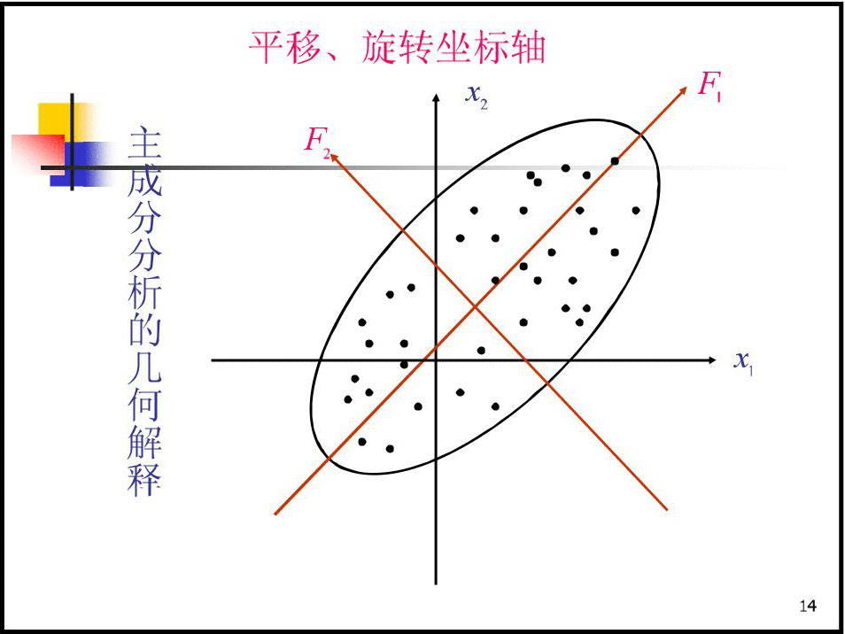
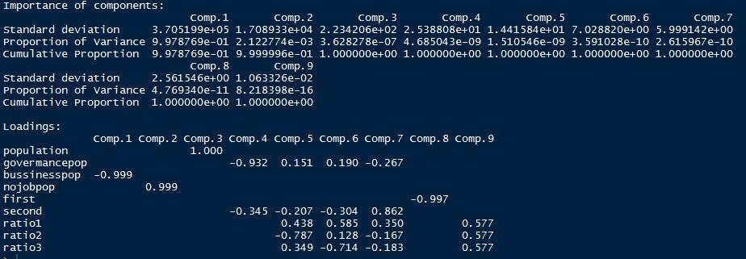
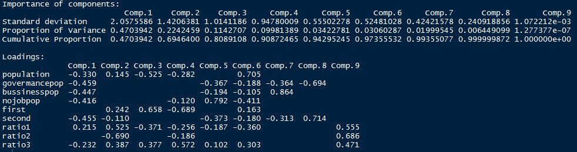

# Priciple Component Analysis {#pca}

本篇是第十二章，内容是主成分分析。

## 主成分分析基本思想

依旧从问题开始本篇的介绍。地理学和生态学研究里经常遇到的问题就是，影响变量非常之多，而且地球表层地理生态环境现象无法使用控制变量的方式进行实验。同时影响变量非常多，经常出现变量冗余、冗杂的现象，同时多元分布数据本身对人类的认知就是一种挑战。这里举个栗子：比如在研究城市经济发展的时候，我们会考虑到的因素会包括第一产业、第二产业、第三产业占比，城市人口，城市地理位置，城市气候适宜度，政策扶持等等很多因子，但是这里有很多因子存在共线性的情况，也就是变量冗余冗杂。用矛盾论的话说，要抓住主要矛盾，那么如何在多元分布数据中分离出主要的因子，这就是本篇的主角主成分分析（Priciple Component Analysis，PCA）。

所以它的**基本思想**是，在社会经济的研究中，为了全面系统的分析和研究问题，必须考虑许多经济指标，这些指标能从不同的侧面反映我们所研究的对象的特征，但在某种程度上存在信息的重叠，具有一定的相关性。这种信息的重叠有时甚至会抹杀事物的真正特征与内在规律。

主成分分析是利用降维的思想， 在力求数据信息丢失最少的原则下，对高维的变量空间降维，即在众多变量中找出少数几个综合指标（原始变量的线性组合），并且这几个综合指标将尽可能多地保留原来指标变异方面的信息，且这些综合指标互不相关。这些综合指标就称为主成分。主成分的数目少于原始变量的数目。

在一个低维空间识辨系统要比在一个高维空间容易得多。因此，更容易抓住主要矛盾，揭示事物内部变量之间的规律性，使问题得到简化，提高分析效率。指标间具有相关性是做主成分分析的前提。

主成分分析是一种数学变换方法，它把给定的一组变量通过线性变换转换为一组不相关的变量。在这种变换中，保持变量的总方差不变，同时，使第一主成分具有最大方差，第二主成分具有次大方差，依此类推。

**主成分与原始变量间的关系**

（1）每一个主成分是原始变量的线性组合。

（2）主成分的数目少于原始变量的数目。

（3）主成分保留了原始变量的大多数变异信息。

（4）各主成分间互不相关。

## 几何解释与数学模型

### 几何解释
假定只有二维，即只有两个变量，由横坐标和纵坐标所代表；每个观测值都有相应于这两个坐标轴的坐标值。如果这些数据形成一个椭圆形状的点阵（这在二维正态的假定下是可能的）该椭圆有一个长轴和一个短轴。在短轴方向上数据变化较少。在极端的情况，短轴如退化成一点，长轴的方向可以完全解释这些点的变化，由二维到一维的降维就自然完成了。

```{r echo=FALSE, out.width = '100%', out.height = '50%', message=FALSE, warning=FALSE}

```

由图可以看出这些样本点无论是沿着$x_l$轴方向或$x_2$轴方向都具有较大的离散性，其离散的程度可以分别用观测变量$x_l$的方差和$x_2$的方差定量地表示。显然，如果只考虑$x_1$和$x_2$中的任何一个，那么包含在原始数据中的经济信息将会有较大的损失。

当坐标轴和椭圆的长短轴平行，那么代表长轴的变量就描述了数据的主要变化，而代表短轴的变量就描述了数据的次要变化。但是，坐标轴通常并不和椭圆的长短轴平行。因此，需要寻找椭圆的长短轴，并进行变换，使得新变量和椭圆的长短轴平行。如果长轴变量代表了数据包含的大部分信息，就用该变量代替原先的两个变量（舍去次要的一维），降维就完成了。椭圆的长短轴相差得越大，降维也越有道理。

### 数学模型

如果我们将xl轴和x2轴先平移，再同时按逆时针方向旋转$\theta$角度，得到新坐标轴Fl和F2。Fl和F2是两个新变量。根据旋转变换的公式：

$$\begin{cases} y_1=x_1\cos\theta+x_2\sin\theta \\ y_2=-x_1\sin\theta+x_2\cos\theta \end{cases}$$

$$\begin{pmatrix} y_1 \\ y_2 \end{pmatrix}=\begin{pmatrix} \cos\theta & \sin\theta \\ -\sin\theta & \cos\theta \end{pmatrix} \begin{pmatrix} x_1 \\ x_2 \end{pmatrix}=U'x$$

$U'$为旋转变换矩阵，它是正交矩阵，即有$U'=U^{-1},U'U^{-1}=I$。旋转变换的目的是为了使得n个样品点在$F_l$轴方向上的离散程度最大，即$F_l$的方差最大。变量$F_l$代表了原始数据的绝大部分信息，在研究某经济问题时，即使不考虑变量$F_2$也无损大局。经过上述旋转变换原始数据的大部分信息集中到$F_l$轴上，对数据中包含的信息起到了浓缩作用。$F_l$， $F_2$除了可以对包含在$X_l$，$X_2$中的信息起着浓缩作用之外，还具有不相关的性质，这就使得在研究复杂的问题时避免了信息重叠所带来的虚假性。二维平面上的个点的方差大部分都归结在$F_l$轴上，而$F_2$轴上的方差很小。 $F_l$和$F_2$称为原始变量，$x_1$和$x_2$的综合变量。 简化了系统结构，抓住了主要矛盾。

**多维情形**

多维变量的情况和二维类似。正如二维椭圆有两个主轴，三维椭球有三个主轴一样，有几个变量，就有几个主轴。和二维情况类似，高维椭球的主轴也是互相垂直的。首先把高维椭球的主轴找出来，再用代表大多数数据信息的最长的几个轴作为新变量。这些互相正交的新变量是原先变量的线性组合，叫做主成分(principal component)。

假设我们所讨论的实际问题中，有p个指标，我们把这p个指标看作p个随机变量，记为$X_1,X_2,\cdots,X_p$，主成分分析就是要把这个p指标的问题，转变为讨论p个指标的线性组合的问题，而这些新的指标$F_1,F_2,\cdots,F_k(k\le p)$，按照保留主要信息量的原则充分反映原指标的信息，并且相互独立。

这种由讨论多个指标降为少数几个综合指标的过程在数学上就叫做降维。主成分分析通常的做法是，寻求原指标的线性组合Fi。
$$F_1=u_{11}X_1+u_{21}X_2+\cdots+u_{p1}X_p$$ 

$$F_2=u_{12}X_1+u_{22}X_2+\cdots+u_{p2}X_p$$ 

$$\cdots$$ 

$$F_p=u_{1p}X_1+u_{2p}X_2+\cdots+u_{pp}X_p$$

**满足条件**

每个主成分的系数平方和为1。即$u_{1i}^2+u_{2i}^2+\cdots+u_{pi}^2=1$，主成分之间相互独立，即无重叠的信息。即$Cov(F_i,F_j)=0,i\neq j,i,j=1,2,\cdots,p$。主成分的方差依次递减，重要性依次递减，即$$Var(F_1)\ge Var(F_2)\ge \cdots \ge Var(F_p)$$


## 主成分的推导

**两个线性代数的结论**

（1）若A是p阶实对称矩阵，则一定可以找到正交阵U，使

$$U^{-1}AU=\begin{bmatrix} \lambda_1 & 0 & \cdots & 0 \\ 0 & \lambda_2 & \cdots & 0 \\ \vdots & \vdots & \ddots & \vdots \\ 0 & 0 & \cdots & \lambda_p \end{bmatrix}_{p\times p}$$


其中$\lambda_i,i=1,2,\cdots,p$是A的特征根。

（1）若上述矩阵的特征根所对应的单位特征向量为$u_1,\cdots,u_p$。令$U=(u_1,\cdots,u_p)=\begin {bmatrix} u_{11} & u_{12} & \cdots &  u_{1p} \\ u_{21} & u_{22} & \cdots & u_{2p} \\ \vdots & \vdots & & \vdots \\ u_{p1} & u_{p2} & \cdots & u_{pp} \end {bmatrix}$则实对称阵A属于不同特征根所对应的特征向量是正交的，即有$U'U=UU'=I$

**第一主成分**

设X的协方差阵为$\Sigma_x=\begin {bmatrix} \sigma_{11} & \sigma_{12} & \cdots & \sigma_{1p} \\ \sigma_{21} & \sigma_{22} & \cdots & \sigma_{2p} \\ \vdots & \vdots & & \vdots \\ \sigma_{p1} & \sigma_{p2} & \cdots & \sigma_{pp} \end {bmatrix}$。由于$\Sigma_x$为非负定的对称阵，必存在正交阵U，使得：

$$U'\Sigma_x U=\begin {bmatrix} \lambda_1 & & 0 \\  & \ddots  & \\ 0 & & \lambda_p \end {bmatrix}$$

其中$\lambda_1,\lambda_2,\cdots,\lambda_p$为$\Sigma_x$的特征根。

不妨假设$\lambda_1\ge \lambda_2\ge \cdots \ge \lambda_p$。而U恰好是由特征根相对应的特征向量所组成的正交阵。

$$U=(u_1,\cdots,u_p)=\begin {bmatrix} u_{11} & u_{12} & \cdots & u_{1p} \\ u_{21} & u_{22} & \cdots & u_{2p} \\ \vdots & \vdots & & \vdots \\ u_{p1} & u_{p2} & \cdots & u_{pp} \end {bmatrix}$$

$$U_i=(u_{1i},u_{2i},\cdots,u_{pi})' i=1,2,\cdots,p$$

设有p维正交向量$a_1=(a_{11},a_{21},\cdots,a_{p1})'$，$F_1=a_{11}X_1+\cdots+a_{p1}X_p=a'X$，

$$V(F_1)=a_1'\Sigma a_1==a_1'U\begin {bmatrix} \lambda_1 & & & \\ & \lambda_2 & & \\ & & \cdots & & \\ & & & \lambda_p &\end {bmatrix}U'a_1$$

当且仅当$a_1=u_1$时，即$F_1=u_{11}X_1+\cdots+u_{p1}X_p$时，有最大的方差$\lambda_1$。$Var(F_1)=U_1'\Sigma_x U_1=\lambda_1$。如果第一主成分的信息不够，则需要寻找第二主成分。

**第二主成分**

在约束条件$cov(F_1,F_2)=0$下，寻找第二主成分，取线性变换，$F_2=u_{12}X_1+\cdots+u_{p2}X_p$的方差次大。

$$cov(F_1,F_2)=cov(u_1'x,u_2'x)=u_2'\Sigma u_1=\lambda_1 u_2'u_1=0$$

$$Var(F_2)=U_2'\Sigma_x U_2=\lambda_2$$

类推

$$F_1=u_{11}X_1+u_{21}X_2+\cdots+u_{p1}X_p$$ 

$$F_2=u_{12}X_1+u_{22}X_2+\cdots+u_{p2}X_p$$ 

$$\cdots$$ 

$$F_p=u_{1p}X_1+u_{2p}X_2+\cdots+u_{pp}X_p$$

写成矩阵形式：

$$F=U'X$$

$$U=(u_1,\cdots,u_p)=\begin {bmatrix} u_{11} & u_{12} & \cdots & u_{1p} \\ u_{21} & u_{22} & \cdots & u_{2p} \\ \vdots & \vdots & & \vdots \\ u_{p1} & u_{p2} & \cdots & u_{pp} \end {bmatrix}$$

$$X=(X_1,X_2,\cdots,X_p)'$$ 

## 主成分的性质

（1）**均值** $E(U'x)=U'\mu$

（2）**方差为所有特征根之和**

$$\sum_{i=1}^pVar(F_i)=\lambda_1+\lambda_2+\cdots+\lambda_p=\sigma_1^2+\sigma_2^2+\cdots+\sigma_p^2$$
说明主成分分析把p个随机变量的总方差分解成为p个不相关的随机变量的方差之和。协方差矩阵$\Sigma$的对角线上的元素之和等于特征根之和。

（3）**精度分析**

> * 贡献率：第i个主成分的方差在全部方差中所占比重$\lambda_i/\sum_{i=1}^p\lambda_i$，称为贡献率，体现这个主成分的综合能力的大小，即反映原来p个指标的信息的多少。
> * 累积贡献率：前k个主成分共有多大的综合能力，用这个k个主成分的方差和在全部方差中所占比重$\sum_{i=1}^k\lambda_i/\sum_{i=1}^p\lambda_i$来描述，称为累积贡献率。我们进行主成分分析的目的之一是希望用尽可能少的主成分$F_1,F_2,\cdots,F_k(k\le p)$代替原来的p个指标。到底应该选择多少个主成分，在实际工作中，所采用主成分个数的多少取决于能够反映原来变量85%以上的信息量为依据，即当累积贡献率$\geq85$时%的主成分的个数就足够了。最常见的情况是主成分为2到3个。

（3）**载荷矩阵**

$$\begin {bmatrix} u_{11} & u_{12} & \cdots & u_{1m} \\ u_{21} & u_{22} & \cdots & u_{2m} \\ \vdots & \vdots & & \vdots \\ u_{p1} & u_{p2} & \cdots & u_{pm} \end {bmatrix}$$

**原始变量与主成分之间的相关系数**

$$F_j=u_{1j}x_1+u_{2j}x_2+\cdots+u_{pj}x_p j=1,2,\cdots,m,m\le p$$

$$F=U'X UF=X$$

$$\begin {bmatrix} x_1 \\ x_2 \\ \vdots \\ x_p \end {bmatrix}=\begin {bmatrix} u_{11} & u_{12} & \cdots & u_{1p} \\ u_{21} & u_{22} & \cdots & u_{2p} \\ \vdots & \vdots & & \vdots \\ u_{p1} & u_{p2} & \cdots & u_{pp} \end {bmatrix}\begin {bmatrix} F_1 \\ F_2 \\ \vdots \\ F_p \end {bmatrix}$$

$$Cov(x_i,F_j)=Cov(u_{i1}F_1+u_{i2}F_2+\cdots+u_{ip}F_p,F_j)=u_{ij}\lambda_j$$

$$\rho(x_i,F_j)=\frac{u_{ij}\lambda_j}{\sigma_i\sqrt{\lambda_j}}=\frac{u_{ij}\sqrt{\lambda_j}}{\sigma_i}$$

可见，$x_i$和$F_j$的相关的密切程度取决于对应线性组合系数的大小。该相关系数又叫因子负荷量。在解释主成分的成因或是第i个变量对第k个主成分的重要性时，应当根据因子负荷量而不是变换系数u.

**原始变量被主成分的提取率：**主成分的贡献率和累计贡献率度量了$F_1,F_2,\cdots,F_m$分别从原始变量$X_1,X_2,\cdots,X_P$中提取了多少信息。那么$X_1,X_2, \cdots,X_P$各有多少信息分别被$F_1,F_2,\cdots,F_m$提取？这可以用$F_1,F_2,\cdots,F_m$分别与$X_1, X_2,\cdots,X_P$的相关系数的平方来衡量。

$$Var(x_i)=Var(u_{i1}F_1+u_{i2}F_2+\cdots+u_{ip}F_p)$$

则

$$u_{i1}^2\lambda_1+u_{i2}^2\lambda_2+\cdots+u_{im}^2\lambda_m+\cdots+u_{ip}^2\lambda_p=\sigma_i^2$$

$u_{ij}^2\lambda_j$是$F_j$能说明的第i 原始变量的方差。$u_{ij}^2\lambda_j/\sigma_i^2$是$F_j$提取的第i原始变量信息的比重。
如果我们仅仅提出了m个主成分，则第i原始变量信息的被提取率为：

$$\Omega_i=\sum_{j=1}^m\lambda_ju_{ij}^2/\sigma_i^2=\sum_{j=1}^m\rho_{ij}^2$$

**公共成分**

定义：如果一个主成分仅仅对某一个原始变量有作用，则称为特殊成分。如果一个主成分对所有的原始变量都起作用，则称为公共成分。

## 主成分分析的步骤

第一步：由X的协方差阵或相关系数阵$\Sigma$，求出其特征根，即解方程，可得特征根。

第二步：求出特征根所对应的特征向量$U_1,U_2,\cdots,U_p$，

$$U_i=(u_{1i},u_{2i},\cdots,u_{pi})'$$

第三步：计算累积贡献率，给出恰当的主成分个数。

$$F_i=U_i'X,i=1,2,\cdots,k(k\le p)$$

第四步：计算所选出的k个主成分的得分。将原始数据的中心化值:

$$X_i^*=X_i-\bar X=(x_{1i}-\bar x_1,x_{2i}-\bar x_2,\cdots,x_{pi}-\bar x_p)'$$

代入前k个主成分的表达式，分别计算出各单位k个主成分的得分，并按得分值的大小排队。

**基于协方差矩阵**

在实际问题中， X的协方差通常是未知的，样品有

$$X_1=(x_{1l},x_{2l},\cdots,x_{pl})'(l=1,2,\cdots,n)$$

$$\hat \Sigma_x=(\frac{1}{n-1}\sum_{l=1}^n(x_{ij}-\bar x_i)(x_{jl}-\bar x_j))_{p\times p}$$

**基于相关系数矩阵**

如果变量有不同的量纲， 变量水平差异很大，应该基于相关系数矩阵进行主成分分析。不同的是计算得分时应采用标准化后的数据。

## 主成分的应用与回归

（1）主成分分析能降低所研究的数据空间的维数。即用研究m维的Y空间代替p维的X空间($m<p$)，而低维的Y空间代替高维的x空间所损失的信息很少。即使只有一个主成分$Y_1$(即m＝1)时，这个$Y_1$仍是使用全部X变量(p个)得到的。在所选的前m个主成分中，如果某个$X_i$的系数全部近似于零的话，就可以把这个$X_i$删除，这也是一种删除多余变量的方法。

（2）多维数据的一种图形表示方法。多元统计研究的问题大都多于3个变量，要把研究的问题用图形表示出来是不可能的。然而，经过主成分分析后，我们可以选取前两个主成分或其中某两个主成分，根据主成分的得分，画出n个样品在二维平面上的分布情况，由图形可直观地看出各样品在主分量中的地位。

（3）用主成分分析法构造回归模型。即把各主成分作为新自变量代替原来的自变量做回归分析。

**主成分回归方法**

$$F_1=u_{11}X_1+u_{21}X_2+\cdots+u_{p1}X_p$$ 
$$F_2=u_{12}X_1+u_{22}X_2+\cdots+u_{p2}X_p$$ 

$$\cdots$$ 

$$F_p=u_{1p}X_1+u_{2p}X_2+\cdots+u_{pp}X_p$$

$$Y_i^*=\gamma_1F_{11}+\gamma_2F_{12}+\cdots+\gamma_mF_{1m}+\varepsilon_i$$ 

$$\sum_{i=1}^n[Y_i^*-\gamma_1F_{11}-\gamma_2F_{12}-\cdots-\gamma_mF_{1m}]^2=min$$

原始数据观测矩阵

$$X_0=\begin {bmatrix} x_{11} & x_{12} & \cdots & x_{1p} \\ x_{21} & x_{22} & \cdots & x_{2p} \\ \vdots & \vdots & & \vdots \\ x_{n1} & x_{n2} & \cdots & x_{np} \end {bmatrix}$$

主成分系数矩阵

$$U=(u_1,\cdots,u_p)=\begin {bmatrix} u_{11} & u_{12} & \cdots & u_{1p} \\ u_{21} & u_{22} & \cdots & u_{2p} \\ \vdots & \vdots & & \vdots \\ u_{p1} & u_{p2} & \cdots & u_{pp} \end {bmatrix}$$

主成分得分矩阵

$\begin {bmatrix} F_{11} & F_{12} & \cdots & F_{1p} \\ F_{21} & F_{22} & \cdots & F_{2p} \\ \vdots & \vdots & & \vdots \\ F_{n1} & F_{n2} & \cdots & F_{np} \end {bmatrix}$ 

$F=X_0U$

**主成分分析的一些注意事项**

主成分分析依赖于原始变量，也只能反映原始变量的信息。所以原始变量的选择很重要。
如果原始变量本质上独立，那么降维就可能失败，这是因为很难把很多独立变量用少数综合的变量概括。数据越相关，降维效果就越好。
分析结果并不一定会有清楚的解释。这与问题的性质，选取的原始变量以及数据的质量等都有关系。

**基于相关系数矩阵还是基于协方差矩阵做主成分分析？**

有时基于相关系数矩阵和基于协方差矩阵求出的主成分会有很大不同，且两者之间不存在简单的线性关系。
一般而言，当分析中所选择的经济变量具有不同的量纲，变量水平差异很大，应考虑将数据标准化，选择基于相关系数矩阵的主成分分析。对同度量或是取值范围在同量级的数据，选择基于协方差矩阵的主成分分析。

**选择几个主成分？**

主成分分析的目的是简化变量，一般情况下主成分的个数应该小于原始变量的个数。关于保留几个主成分，应该权衡主成分个数和保留的信息。

**如何解释主成分所包含的经济意义？**

主成分分析不要求数据来自于正态总体。一般认为当原始数据大部分变量的相关系数都小于0.3时，运用主成分分析的效果不显著。

## 主成分分析的R语言实现
主成分分析的函数本篇介绍的主要有两个。一个是princomp，一个是psych里的principal。

    princomp(x,cor=FALSE,scores=TRUE)
    
x为主成分分析数据集，cor=TRUE和FALSE分别代表是基于相关系数矩阵计算还是协方差矩阵计算。scores则代表是否存储主成分得分。

    principal(x,nfactors=2,rotate="varimax",scores=T,covar=F)
    
x为主成分分析数据集，nfactors为主成分个数，rotate表示旋转方式（一般选方差最大，保证互不相关），scores则代表是否存储主成分得分，covar=TRUE和FALSE分别代表是基于协方差矩阵计算还是相关系数矩阵计算。

这回用的数据是2006年城市统计年鉴285个地级市的经济人口数据，探究gdp与人口之间的关系。先做一个相关系数可视化。发现人口因子之间相互影响作用很高。

```{r echo=FALSE, out.width = '100%', out.height = '40%', message=FALSE, warning=FALSE}
library(psych)
library(corrplot)
a <- read.csv('https://github.com/GISerDaiShaoqing/Note-of-Applied-Statistics-with-R/raw/master/Appendix/Data/city2006.csv',header=T)
aclean<-na.omit(a)

#Plot the correlation
acor<-corr.test(aclean[,-1])
acorp<-acor$p
acorp[upper.tri(acorp)]=0
par(fig=c(0,1,0.1,1))
corrplot.mixed(acor$r,upper="square",lower="number",
               diag="u",tl.cex=1,tl.col="black",tl.pos="lt",number.cex=0.8,
               cl.cex=1,p.mat=acorp, sig.level=0.05,insig=c("blank"))
```


于是先对人口的几个因子进行降维和主成分分析，中途发现第三产业从业人数（third)加入会使得系数矩阵不正定，后面就删除了第三产业从业人数(third)。分别用不同方式进行主成分分析结果。

- princomp结果（基于协方差矩阵）

碎石图

```{r echo=FALSE, out.width = '100%', out.height = '40%', message=FALSE, warning=FALSE}
apca1<-princomp(aclean[,-c(1:2,9)])
screeplot(apca1,type='line')
```

结果

```{r echo=FALSE, out.width = '100%', out.height = '35%', message=FALSE, warning=FALSE}

```

主成分得分图

```{r echo=FALSE, out.width = '100%', out.height = '40%', message=FALSE, warning=FALSE}
biplot(apca1)
```

- princomp结果（基于相关系数矩阵）

碎石图

```{r echo=FALSE, out.width = '100%', out.height = '40%', message=FALSE, warning=FALSE}
apca1<-princomp(aclean[,-c(1:2,9)],cor=T)
screeplot(apca1,type='line')
```

结果

```{r echo=FALSE, out.width = '100%', out.height = '35%', message=FALSE, warning=FALSE}

```

主成分得分图

```{r echo=FALSE, out.width = '100%', out.height = '40%', message=FALSE, warning=FALSE}
biplot(apca1)
```

- principal结果

碎石图

```{r echo=FALSE, out.width = '100%', out.height = '40%', message=FALSE, warning=FALSE}
fa.parallel(aclean[,-c(1:2,9)],fa="pc",n.iter = 100,show.legend = T,main="Scree plot with Parallel analysis")
```

因子关系图

```{r echo=FALSE, message=FALSE, warning=FALSE, out.height='40%', out.width='100%'}
apca2<-principal(aclean[,c(3:8,10,11,12)],nfactors=2,rotate="varimax",scores=T)
fa.diagram(apca2)
```

主成分得分图

```{r echo=FALSE, out.width = '100%', out.height = '40%', message=FALSE, warning=FALSE}
biplot(apca2)
```

碎石图表示的是曲线与纵坐标1交点的横坐标即为主成分个数，而主成分得分荷图是将原始数据的坐标映射在主成分分析的坐标上，事实上可以根据主成分得分在不同象限对原始数据进行分类，在本篇的样例数据里其实就是可以通过人口生成的几个主成分对中国地级市进行分类，可以区分出是在第一主成分得分高，第二主成分得分低的城市，亦或是其他排列组合的分类结果。关于这种可视化图具体如何解释。可以参照如下的文章。

>http://www.cnblogs.com/SCUJIN/p/5965946.html
