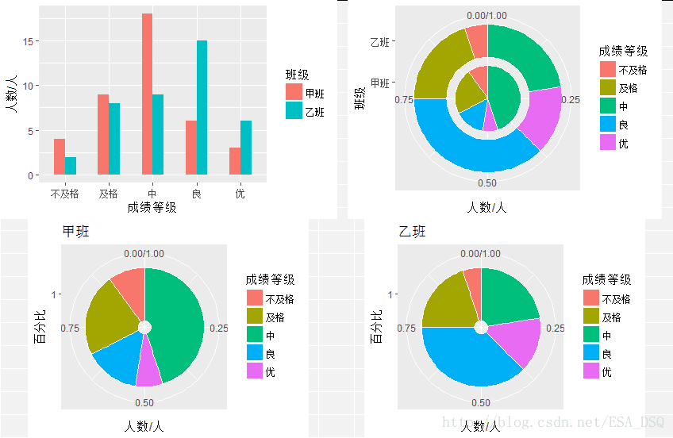

# Case and Practice {#homework}

本篇是第十四章，内容是案例与实践。这里其实是对我公选课的作业做了个汇总。

## 描述性统计与抽样分布

1.一种袋装食品用生产线自动装填，每袋重量大约为50g，但由于某些原因，每袋重量不会恰好是50g。下面是随机抽取的100袋食品，测得的重量数据见附录。

（1）构建这些数据的频数分布表。

（2）绘制频数分布的直方图。

（3）说明数据分布的特征。

2.甲乙两个班各有40名学生，期末统计学考试成绩的分布见附录。

（1）根据上面的数据，画出两个班考试成绩的复合柱形图、环形图和图饼图。

（2）比较两个班考试成绩分布的特点。

（3）画出雷达图，比较两个班考试成绩的分布是否相似。

3.随机抽取25个网络用户，得到他们的年龄数据（单位：周岁）见附录。

（1）计算众数、中位数。

（2）根据定义公式计算四分位数。

（3）计算平均数和标准差。

（4）计算偏态系数和峰态系数。

（5）对网民年龄的分布特征进行综合分析。

4.某银行为缩短顾客到银行办理业务等待的时间，准备采用两种排队方式进行试验：一种是所有顾客都进入一个等待队列；另一种是顾客在三个业务窗口处列队三排等待。为比较哪种排队方式使顾客等待的时间更短，两种排队方式各随机抽取的9名顾客，得到第一中排队方式的平均等待时间为7.2分钟，标准差为，1.97分钟，第二种排队方式的等待时间（单位：min）见附录。

（１）画出第二种排队方式等待时间的茎叶图。

（２）计算第二种排队方式等待时间的平均数和标准差。

（３）比较两种排队方式等待时间的离散程度。
（４）如果让你选择一种排队方式，你会选择哪一种？试说明理由。


5.从均值为200、标准差为50的总体中，抽取n=100的简单随机样本，用样本均值`x估计总体均值。 

a)描述重复抽样的样本均值的抽样分布。 

b)不重复抽样，总体单位数分别为10000、1000时的样本均值的抽样分布。 

## 参数估计与假设检验
1.某大学为了解学生每天上网的时间，在全校7500名学生中采取不重复抽样方法随机抽取36人，调查他们每天上网的时间（单位：小时） ，得到的数据见附录。求该校大学生平均上网时间的置信区间，置信概率分别为90%、95%和99%。


2.假定两个总体的标准差分别为：$\sigma_1=12$，$\sigma_2=15$，若要求误差范围不超过5，相应的置信水平为95%，假定$n_1=n_2$，估计两个总体均值之差$m_1-m_2$时所需的样本容量为多大？ 


3.经验表明，一个矩形的宽与长之比等于0.618的时候会给人们比较良好的感觉。某工艺品工厂生产的矩形工艺品框架的宽与长要求也按这一比例设计，假定其总体服从正态分布，现随机抽取了20个框架测得比值见附录。在显著性水平 ＝0.05时，能否认为该厂生产的工艺品框架宽与长的平均比例为0.618？。


4.一家大型超市连锁店上个月接到许多消费者投诉某种品牌炸土豆片中60克一袋的那种土豆片的重量不符。店方猜想引起这些投诉的原因是运输过程中沉积在食品袋底部的土豆片碎屑，但为了使顾客们对花钱买到的土豆片感到物有所值，店方仍然决定对来自于一家最大的供应商的下一批袋装炸土豆片的平均重量（克）进行检验，假设陈述如下： 

$H_0:\mu\le 60$

$H_1:\mu>60$

如果有证据可以拒绝原假设，店方就拒收这批炸土豆片并向供应商提出投诉。

（1）与这一假设检验问题相关联的第一类错误是什么？

（2）与这一假设检验问题相关联的第二类错误是什么？

（3）你认为连锁店的顾客们会将哪类错误看得较为严重？而供应商会将哪类错误看得较为严重？

## 方差分析与回归分析
1.某家电制造公司准备购进一批5#电池，现有A、B、C三个电池生产企业愿意供货，为比较它们生产的电池质量，从每个企业各随机抽取5只电池，经试验得其寿命（单位：h）数据见附录。试分析三个企业生产的电池的平均寿命之间有无显著差异（$\alpha=0.05$）。如果有差异，用LSD方法检验哪些企业之间有差异？


2.一家超市连锁店的老板进行一项研究，确定超市所在的位置和竞争者的数量对销售额是否有显著影响。获得的月销售额数据（单位：万元）见附录。取显著性水平$\alpha=0.01$，检验：

（1）竞争者的数量对销售额是否有显著影响。

（2）超市的位置对销售额是否有显著影响。

（3）竞争者的数量和超市的位置对销售额是否有交互影响。


3.附录中有随机抽取的15家大型商场销售的同类产品的有关数据（单位：元）。

（1）计算y与$x_1$ 、y与$x_2$之间的相关系数，是否有证据表明销售价格与购进价格、销售价格与销售费用之间存在线性关系？

（2）根据上述结果，你认为用购进价格和销售费用来预测销售价格是否有用？

（3）用Excel进行回归，并检验模型的线性关系是否显著（$\alpha=0.05$）。

（4）解释判定系数$R^2$，所得结论与问题（2）中是否一致?

（5）计算$x_1$与$x_2$之间的相关系数，所得结果意味着什么？

（6）模型中是否存在多重共线性？你对模型有何建议？


4.附录中有32名美士足球运动员的rating及其他相关信息。请建立一个回归模型以预测一位美士足球运动员的rating。提交报告包括：使用什么方法建立的模型，该方法的运行结果，最终模型的解释（拟合程度、预测误差）。

这一份作业汇总从最原始的描述统计、参数估计、假设检验到基础的方差分析与回归分析均有了。根据这里的习题即可对前面的内容再次熟悉。这里就不多说了，我有一份比较完整的文档针对这份内容。

## 作业文档

```{r}
#load library
library(openxlsx)
library(ggplot2)
library(psych)
library(gridExtra)
```
### 1 描述性统计与抽样分布
1.

（1）频数分布表

```{r message=FALSE, warning=FALSE, include=FALSE}
a <- read.xlsx("https://github.com/GISerDaiShaoqing/Note-of-Applied-Statistics-with-R/raw/master/Appendix/Data/exercise1.xlsx",sheet = 1, colNames = F)
```


```{r}
#Input data
table(a)
```

（2）频数分布图

```{r}
hist(a$X1, col = "lightblue", xlab = "weight/g")
```

```{r r}
ahist<-ggplot(a)+geom_histogram(mapping = aes(a$X1),fill=rgb(red = 0, green = 107, blue = 200, max = 255),binwidth=0.5,stat = "bin",position = "identity")+labs(x="weight/g",y="Frequency")
ahist
```

（3）数据整体呈一个“双峰”分布。而且刚好50 g的食品非常少。大部分集中在47和53附近。

2.

（1）

```{r message=FALSE, warning=FALSE, include=FALSE}
b <- read.xlsx("https://github.com/GISerDaiShaoqing/Note-of-Applied-Statistics-with-R/raw/master/Appendix/Data/exercise1.xlsx", sheet = 2)
```

```{r}
#Input data and clean data
b <- b[, -c(1:9)]
b <- data.frame(gl = b[, 1], p = b[, 2], c = b[, 3])
```


(2)甲班中等成绩的人最多，而优良成绩的人比不及格和及格的人少。乙班成绩为良的最多，而且不及格人数与及格人数均比甲班少。仅有中等成绩的人比甲班少，其他均多于甲班。

(3)

```{r echo=FALSE, out.width = '100%', out.height = '45%', message=FALSE, warning=FALSE}

```

甲乙两个班成绩分布差异较大。甲班中等成绩人居多，而且相比较而言，中等成绩人数量十分突出。而乙班则较为均衡，良成绩的人较少些。

3.

```{r message=FALSE, warning=FALSE, include=FALSE}
c <- read.xlsx("https://github.com/GISerDaiShaoqing/Note-of-Applied-Statistics-with-R/raw/master/Appendix/Data/exercise1.xlsx", sheet = 3)
```

```{r}
describe(c)
table(c)
```
（1）众数：19和23、中位数：23

（2）四分位数：19（上四分位数）、27（下四分位数）

（3）平均数：24、标准差：6.65

（4）偏态系数：0.95、峰态系数：0.13

（5）网民整体分布呈现一个右偏的尖峰分布，但是平均数与中位数较为接近。整体分布还是较为平稳。

4.

```{r message=FALSE, warning=FALSE, include=FALSE}
d <- read.xlsx("https://github.com/GISerDaiShaoqing/Note-of-Applied-Statistics-with-R/raw/master/Appendix/Data/exercise1.xlsx", sheet = 4)
```

```{r}
stem(d[, 1])
summary(d)
describe(d)
```

（1）
茎叶图
5 | 5
6 | 
6 | 678
7 | 134
7 | 88

（2）平均数：7.0，标准差0.71。

（3）第一种方式标准差要远大于第二种方式，所以第一种方式离散程度较大。

（4）我会选择第二种，首先，第二种平均等待时间小于第一种，同时标准差则远小于第一种。也就是说明平均的等待时间小于第一种，同时等待时间也不会偏离7分钟太多。

5.

重复抽样

$$\sigma_{\bar x}^2=\frac{\sigma^2}{n}$$ 


（a）首先认为n=100的情况下属于大样本，可以认为近似正态分布，所以重复抽样的样本均值的抽样分布也遵循正态分布，所以样本均值抽样分布的期望值为200，方差为25

（样本总体有限，且$n\ge 5\%N$不重复抽样）

$$\sigma_{\bar x}^2=\frac{\sigma^2}{n}\frac{N-n}{N-1}$$

（b）不重复抽样的样本均值的抽样分布同样遵循近似正态分布，总体样本为10000和1000时，简单随机样本的样本量n=100，5%N=500和50，所以当总体样本为10000时样本均值抽样分布的期望为为200，方差为24.75。而当总体样本仅为1000时，不满足n≥5%N的条件，可以按重复抽样计算样本均值的抽样分布：也就是期望值为200，方差为25。

### 2 参数估计与假设检验

1.样本数$n=36>30$，可以认为大样本数据非正态分布，且总体的均值未知，因此，采用z分布计算置信区间，样本均值为3.317，标准差为1.609，置信区间计算公式为：

$$\bar x\pm z_{\alpha/2}\frac{s}{\sqrt{n}}$$
分别带入计算可得。90%置信概率的置信区间为[2.863,3.770]，95%置信概率的置信区间为[2.772,3.861]，99%置信概率的置信区间为[2.586,4.047]。

2.总体均值之差估计（且n1=n2，总体标准差已知）所需样本容量的公式为：

$$n=\frac{(z_{\alpha/2})^2\cdot(\sigma_1^2+\sigma_2^2)}{E^2}$$

其中$E=z_{\alpha/2}\sqrt{\frac{(\sigma_1^2+\sigma_2^2)}{n}}$，误差范围不超过5，即将E=5带入，即可得到n的最小值，即n=56.700，即n=57。

3.假设$H_0: \mu=0.618$，备择假设$H_1: \mu≠0.618$。该问题为总体方差未知的正态小样本均值检验。故选用t分布检验统计量。

$$t=\frac{\bar x-\mu_0}{s/\sqrt{n}}\sim t(n-1)$$

可以得到t=1.932318，而显著性水平$\alpha=0.05$的t分布临界值为2.093024。因为t＜2.093024，所以拒绝$H_0$，无法认为该工厂生产的工艺品框架宽与长度的平均比例为0.618。

4.

（1）第一类错误是弃真错误，也就是原假设为真，却拒绝了原假设。

（2）第二类错误是取伪错误，也就是原假设为假，但未拒绝原假设。

（3）连锁店的顾客们会将取伪错误看得较为严重，因为顾客肯定希望能获得更多的利益，也就是说希望土豆片比60克多，如果商家检验结果是取伪错误——就是事实上，土豆片不到60克，但是检验结果却是大于60克。而供应商则会将弃真错误看得较为严重，因为对供应商来说，土豆片少一点，相当于材料费少了些，对于他们收益是好的，所以他们希望的是土豆片比60克少或者刚好60克，如果商家检验结果是弃真错误——就是事实上，土豆片是大于60克的，但是检验结果却是小于60克。

相关代码及自编假设检验函数。

```{r message=FALSE, warning=FALSE, include=FALSE}
a <- read.xlsx("https://github.com/GISerDaiShaoqing/Note-of-Applied-Statistics-with-R/raw/master/Appendix/Data/exercise2.xlsx", sheet = 1)
```


```{r}
mean(a[, 1])
sd(a[, 1])
```

```{r}
#方差已知的区间估计
conf.int = function(x, sigma, alpha) {
  mean = mean(x)
  n = length(x)
  z = qnorm(1 - alpha/2, mean = 0, sd = 1, lower.tail = T)
  c(mean-sigma*z/sqrt(n), mean + sigma*z/sqrt(n))
}
```

```{r}
#方差未知的区间估计
t.test(a, alternative = "two.sided", conf.level = 0.9)
t.test(a, alternative = "two.sided", conf.level = 0.95)
t.test(a, alternative = "two.sided", conf.level = 0.99)
```

```{r}
#样本容量
#sample number function
samplemin.int = function(sigma1, sigma2, error, alpha) {
  z = qnorm(1-alpha/2, mean = 0, sd = 1, lower.tail = T)
  n = z^2*(sigma1^2 + sigma2^2)/error^2
  cat("The number of Sample is more than", n)
}
#function calculated
samplemin.int(12, 15, 5, 0.05)
```

```{r message=FALSE, warning=FALSE, include=FALSE}
b <- read.xlsx("https://github.com/GISerDaiShaoqing/Note-of-Applied-Statistics-with-R/raw/master/Appendix/Data/exercise2.xlsx", sheet = 2)
```

```{r}
#function meantest
meantest.int = function(x, meanpop, sigmapop, alpha, pop = TRUE) {
  mean = mean(x)
  sd = sd(x)
  n = length(x)
  t0 = qt(1-alpha/2, df = n-1, lower.tail = T)
  z0 = qnorm(1-alpha/2, mean = 0, sd = 1, lower.tail = T)
  if (pop) {
    p = (mean-meanpop)/(sigmapop/sqrt(n))
    status = p-z0
  } else {
    sigmapop = sd
    p = (mean-meanpop)/(sigmapop/sqrt(n))
    status = p-t0
  }
  cat("Hypothesis Test:", status > 0)
}
#function calculated
meantest.int(b[,1], 0.618, 1, 0.05, pop = F)
```

### 3 方差分析与回归分析

```{r}
#load library
library(MASS)
library(openxlsx)
library(psych)
library(corrplot)
```

1.

```{r message=FALSE, warning=FALSE, include=FALSE}
a <- read.xlsx("https://github.com/GISerDaiShaoqing/Note-of-Applied-Statistics-with-R/raw/master/Appendix/Data/exercise3.xlsx", sheet = 4)
```

```{r}
#question1
#variance analysis
a.aov <- aov(battery~company, data = a)
summary(a.aov)
```

根据方差分析结果，三个企业生产的电池的平均寿命之间有显著差异。根据LSD方法进行检验。LSD检验统计量公式如下：

$$LSD=t_{\alpha/2}\sqrt{MSE(\frac{1}{n_i}+\frac{1}{n_j})}$$

带入计算可得，LSD=5.760。然后可以计算可得：

$|\mu A-\mu B|=14.4>5.760$，$|\mu A-\mu C|=1.8<5.760$，$|\mu B-\mu C|=12.6>5.760$。

所以A企业和B企业，B企业和C企业之间是有差异的。

2.本问题为双因素的问题，所以采用双因子方差分析结果（分别选用的无交互作用和有交互作用的）如下：

```{r message=FALSE, warning=FALSE, include=FALSE}
b <- read.xlsx("https://github.com/GISerDaiShaoqing/Note-of-Applied-Statistics-with-R/raw/master/Appendix/Data/exercise3.xlsx", sheet = 6)
```

```{r}
#Input data
#no interaction
b.aov <- aov(value~location+competition, data = b)
summary(b.aov)
```

```{r}
#interaction
bi.aov <- aov(value~location*competition, data = b)
summary(bi.aov)
```

（1）从双因素方差分析的结果来看，F统计值通过了0.001大于设定的显著性水平的显著性检验，可以认为竞争者的数量对销售额有显著影响。

（2）从双因素方差分析的结果来看，F统计值通过了0.001大于设定的显著性水平的显著性检验，可以认为超市的位置对销售额有显著影响。

（3）从双因素方差分析的结果来看，F统计值通过了0.05小于设定的显著性水平的显著性检验，可以认为竞争者的数量和超市的位置对销售额无交互影响。

3.（1）$r_{y,x1}$=0.309，$r_{y,x2}$=0.01。并绘制了散点图，从相关系数来看，y与$x_1$有线性关系，y与$x_2$无线性关系。几何散点图来看，二者的线性关系也不是非常显著。

```{r message=FALSE, warning=FALSE, include=FALSE}
c <- read.xlsx("https://github.com/GISerDaiShaoqing/Note-of-Applied-Statistics-with-R/raw/master/Appendix/Data/exercise3.xlsx", sheet = 3)
```

```{r}
cor(c[,2], c[,3])
cor(c[,2], c[,4])
layout((matrix(c(1,2), nrow = 1, byrow = T)))
plot(c[,2], c[,3])
plot(c[,2], c[,4])
```

（2）用购进价格来预测销售价格可能更有用，销售费用对销售价格影响较小。

```{r}
c.lm <- lm(formula = c[,2]~c[,3]+c[,4])
summary(c.lm)
```

（3）从F检验统计值来看，P值通过了0.1的显著性水平检验，与题目所要求的0.05不符合。所以模型的线性关系不显著。

（4）判定系数$R^2$为0.352，说明销售价格变动的35%是由购进价格和销售费用决定的。线性关系较弱。

```{r}
cor(c[,3], c[,4])
```

（5）$r_{x1,x2}$=-0.853，说明购进价格与销售费用呈现负相关的关系。

（6）模型存在多重共线性，建议使用逐步回归方法去除变量进行回归分析。

4.
首先对变量进行相关分析。

```{r message=FALSE, warning=FALSE, include=FALSE}
d <- read.xlsx("https://github.com/GISerDaiShaoqing/Note-of-Applied-Statistics-with-R/raw/master/Appendix/Data/exercise3.xlsx",sheet=5)
```

```{r}
dcor <- corr.test(d[, c(3:13)])
dcorp <- dcor$p
dcorp[upper.tri(dcorp)]=0
corrplot.mixed(dcor$r, lower = "number", upper = "circle", diag = "u",
               tl.pos = "lt", tl.cex = 0.8, number.cex = 0.8, 
               p.mat = dcorp, sig.level = 0.05, insig = c("blank"))
```

可以发现Rating跟Comp、Comp%，Yds，Yds/Att，TD，TD%和Int%有显著的相关关系，且相关系数均在0.48以上。
接下来绘制Rating跟其余10个指标的散点图。

```{r}
layout((matrix(c(1,2,3,4,5,6,7,8,9,10), nrow = 2, byrow = T)))
for (i in 3:12) {
  plot(d[,c(i)], d[,c(13)], col = "red", pch = 16)
}
```

可以看到与其他10个指标的散点图，线性关系也较为显著。根据相关系数矩阵结果和散点图，选定7个自变量进行逐步回归。结果如下：

```{r}
d.lm <- lm(formula=d$Rating~d$Comp+d$`Comp%`+d$Yds+d$`Yds/Att`+d$TD+d$`TD%`+d$`Int%`)
summary(d.lm)
```

```{r}
d.lms <- step(d.lm)
summary(d.lms)
```

可以看到逐步回归结果只保留了4个自变量（Comp%，Yds/Att，TD%，Int%），模型的$R^2$达到了1.000。说明美式足球员的Ranting变化的100%能够被如上的四个变量进行解释。标准残差为0.205。说明预测精度非常高，残差较小，而F统计值通过了0.01的显著性检验。说明该预测方程可信度较高。


